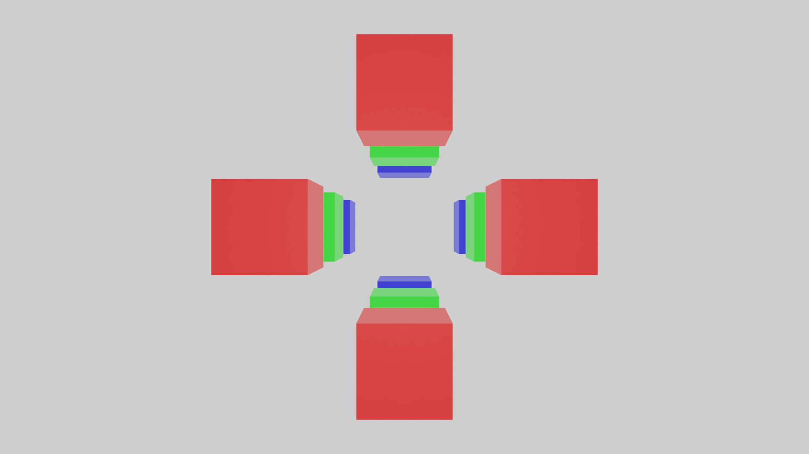
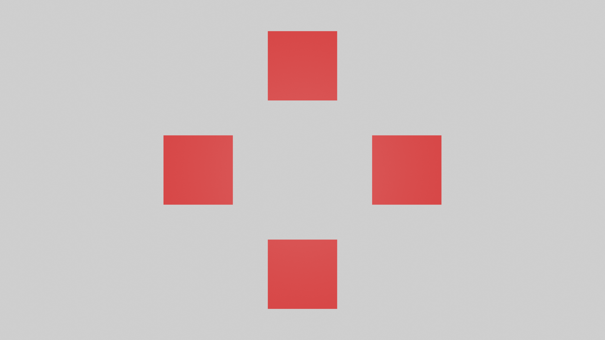

# Grafika házifeladat segítség

Ezen dokumentum személyes tapasztalataimat méltatott megosztani annak érdekében, hogy
a gyakori, ám sok fejfájást okozó hibákra megoldást szolgáltasson, legyen szó az
OpenGL használatáról, vagy általános grafikai dolgokról. A dokumentumban megpróbálom
összegyűjteni azon gyakori hibajelenségeket, melyekkel már találkoztam, kereshető
formátumban, hogy az olvasó elkerülhesse a sok-sok debugolással töltött órát.

## Kamera

OpenGL-ben a "kamera", mint fogalom tökre másképp értelmezendő, mint egy boltban 
kapható kamera. Ugyanis amikor a kamerát mozgatjuk, akkor igazából nem a kamera
mozog, hanem az egész világot mozgatjuk ellenkező irányba. A kamerának pedig 
az a szerepe, hogy egy "ablakot" adjon a virtuális világra. Két fontos mátrix-ot
kell egy kamerában nyilvántartani:

* Projekciós mátrix: Ez definiálja, hogy "mik történnek az egyenesekkel"
	* Ortogonális vetítés esetén a párhuzamos egyenesek párhuzamosak maradnak
	* Perspektív vetítés esetén a párhuzamos egyenesek egy pontba tartanak
* View mátrix: Ez határozza meg a kamera transzformációját
	* Hol van
	* Merre néz
	* Nagyítás

Az ortogonális és perspektív kamerák közti különbség az alábbi képeken látható:





A két kép **ugyanarról a jelenetről** készült, a különbség annyi, hogy az elsőben
perspektív, a másodikban ortogonális vetítést használ a kamera.

A kameráknál még van egy fogalom (aminek a magyar nevét nem tudom), a frustum.
A frustum az a 3D test, amiben a benne lévő objektumokat látjuk, és a belőle kívül
eső objektumokat nem. Szemléletesen a perspektív vetítés esetén ez a frustum egy
csonka gúla, ortogonális esetben egy egyszerű téglatest.

### Ortogonális vetítési mátrix

```cpp
/* Ez csinál egy egységmátrixot a referenciaként átvett mat4-ben */
inline void IdentityMatrix (mat4 &matrix) {
	
	for (int i = 0; i < 4; i++) {
		for (int j = 0; j < 4; j++) {
			matrix.m [i][j] = 0.0f;
		}
		matrix.m [i][i] = 1.0f;
	}
	
}

/* Ez megcsinálja az ortogonális vetítési mátrixot a referenciaként átvett mat4-ben */
inline void OrthographicProjection (
	float left, 
	float right, 
	float top, 
	float bottom,
	float n,
	float f,
	mat4 &matrix
) {
	
	IdentityMatrix (matrix);
	
	matrix.m [0][0] = 2.0f / (right - left);
	matrix.m [1][1] = 2.0f / (top - bottom);
	matrix.m [2][2] = -2.0f / (f - n);
	matrix.m [3][3] = 1.0f;
	
	matrix.m [0][3] = -1.0f * ( (right + left) / (right - left) );
	matrix.m [1][3] = -1.0f * ( (top + bottom) / (top - bottom) );
	matrix.m [2][3] = -1.0f * ( (f + n) / (f - n) );
	
}
```

* A `left` paraméterrel kontrolláljuk, hogy a "képernyő bal széle melyik X koordinátának felel meg"
* A `right` paraméterrel kontrolláljuk, hogy a "képernyő jobb széle melyik X koordinátának felel meg"
* A `top` paraméterrel kontrolláljuk, hogy a "képernyő teteje melyik Y koordinátának felel meg"
* A `bottom` paraméterrel kontrolláljuk, hogy a "képernyő alja melyik Y koordinátának felel meg"
* A `near`-nél közelebb lévő dolgok, vagy a `far`-nal messzebb lévő dolgok pedig kívül esnek a frustumon, ezeket nem fogjuk kirajzolni

Kvázi a 6 paraméterrel a frustum téglatest 3 oldalát adjuk meg.

## Kochanek-Bartels spline

A spline-ok görbék. A görbéket control point-ok megadásával tudjuk szabályozni, illetve attól függően,
hogy milyen spline-ról beszéljünk más paramétereket is megadhatunk. 

A Kochanek-Bartels spline egy cubic hermite spline, aminek van 3 extra tulajdonsága: _tension_, 
_bias_ és _continuity_. Mindjárt rátérek, hogy ezek micsodák.

A spline-ok kirajzolása úgy történik, hogy a control point-ok között nézünk valami diszkrét beosztást
(tesszelláció), kapunk belőle pontokat, amelyeket szakaszokkal összekötünk. Megfelelő tesszellációs
felbontás esetén egy nagyon sima görbét kapunk, kisebb felbontás esetén láthatóak a szakaszaink.

A cubic hermite spline-ok úgy működnek, hogy minden egyes ponton meg kell határoznunk, hogy mely
két control pont között vagyunk, és ezek után a következő formulával kapjuk meg a spline-on lévő
pontunkat:

```
p(t) = (2 * t^3 - 3 * t^2 + 1) * p0
	+ (t^3 - 2 * t^2 + t) * m0
	+ (-2 * t^3 + 3 * t^2) * p1
	+ (t^3 - t^2) * m1
```

A szimbólumok a képletben a következőek:
	
* `t`: Ez az interpolációs változónk. Két kontrol pont között ez a változó egy `(0, 1)` intervallumba eső értéket
fog felvenni, mindjárt megmutatom, hogyan
* `p0`: Ez a jelenleg vizsgált X koordinátától rögtön balra eső legközelebbi kontrol pont
* `p1`: Ez a jelenleg vizsgált Y koordinátától rögtön jobbra eső legközelebbi kontrol pont
* `m0`: Ez a `p0` pontban a spline deriváltja (meredeksége, irányvektora)
* `m1`: Ez a `p1` pontban a spline deriváltja

Tehát általánosan a következő pszeudókóddal számolhatjuk (közelíthetjük) egy spline pontjait:

```

struct KochanekBartelsResult {
	vec2 d0;
	vec2 d1;
};

vec2 spline (vec2 pos) {

	vec2 p0 = closestLeft (pos);
	vec2 p1 = closestRight (pos);

	KochanekBartelsResult tangentResult = splineTangent ( ... );

	vec2 m0 = tangentResult.d0;
	vec2 m1 = tangentResult.d1;

	float t = (pos.x - p0.x) / (p1.x - p0.x);

	return ( 2.0 * t * t * t - 3.0 * t * t + 1.0 ) * p0
		+ ( t * t * t - 2.0 * t * t + t ) * m0
		+ ( -2.0 * t * t * t + 3.0 * t * t ) * p1
		+ ( t * t * t - t * t ) * m1;

}

```

Ami a spline típusától függ, az a `splineTangent` függvény a fönt olvasható pszeudókódban. Ez a Kochanek-Bartels
spline esetén a következőképp néz ki:

```

struct KochanekBartelsResult {
	vec2 d0;
	vec2 d1;
};

// A p0 az a p(i-1) -- kettővel balra eső control point
// A p1 az a p(i) -- rögtön balra eső control point
// A p2 az a p(i + 1) -- rögtön jobbra eső control point
// A p3 az a p(i + 2) -- kettővel jobbra eső control point
vec2 splineTangent (vec2 p0, vec2 p1, vec2 p2, vec2 p3, float tension, float continuity, float bias) {

	KochanekBartelsResult result;

	result.d0 = ( ( 1.0 - tension ) * ( 1.0 + bias ) * ( 1.0 + continuity ) ) / 2.0 * (p1 - p0)
		+ ( ( 1.0 - tension ) * ( 1.0 - bias ) * ( 1.0 - continuity ) ) / 2.0 * ( p2 - p1 );
	result.d1 = ( ( 1.0 - tension ) * ( 1.0 + bias ) * ( 1.0 - continuity ) ) / 2.0 * (p2 - p1)
		+ ( ( 1.0 - tension ) * ( 1.0 - bias ) * ( 1.0 + continuity ) ) / 2.0 * ( p3 - p2 );

	return result;

}

```

A spline konkrét kiszámolása pedig így néz ki pszeudókódban:

```

void calculateSpline () {

	// Itt feltétel, hogy balról-jobbra X szerint sort-olva legyenek a control pointok
	vec2 start = controlPoints [0];
	vec2 end = controlPoints [controlPoints.size () - 1];

	// Tesszellációs felbontás, lehet bármekkora
	// Igazából most itt az az elképzelés, hogy 1 virtuális egység az 1 pixel,
	// ehhez az ortogonális vetítést kell megfelelően paraméterezni
	float step = 1.0f;

	list <vec2> vertices;

	float x = start.x;
	while (x < end.x) {

		// A spline függvény itt egy explicit spline-t ír le, azaz egy X értékhez
		// kapunk egy Y értéket, mintha valami f(x) = y függvény lenne
		vertices.push_back (vec2 (x, spline (x)));
		x += step;

	}

	// vertices-t most feltölthetjük a videókártyára, ha pl LINE_STRIP-pel kötjük össze a pontokat, 
	// akkor már kapunk egy vonalábrát a spline-ról

}

```