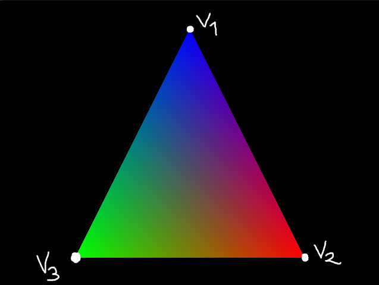

# OpenGL alapok

Ebben a doksiban az OpenGL alapokról van szó, ha végigolvasod, utána már elvileg
mindent tudni fogsz ahhoz, hogy tetszőleges színű és formájú alakzatokat tudj a 
képernyőre rajzolni.

## Mi az a "Vertex"?

Amikor OpenGL-ben rajzolunk bármilyen alakzatot, akkor a legelső feladat az alakzatot
alkotó _geometria_ definiálása. A geometria határozza meg, hogy az adott alakzat/síkidom/test
milyen pontokból áll. Ezen pontokhoz azonban nem kizárólag pozíciót rendelünk általában,
hanem a pontnak lehet több _attribútuma_. Tekintsük az alábbi képet:



A képen egy darab színes háromszög található, amin bejelöltem a pontjait, ezek a `v1`,
`v2` és `v3` pontok. Jól látható, hogy a pontok _pozíciója_, és a _színe_ is más minden
pont esetén. Ebben az esetben minden pontról pontosan kettő attribútumot tárolunk:

* _pozíció_: 2D esetben egy 2 elemű, 3D esetben 3, vagy 4 elemű float vektor
* _szín_: RGB esetben 3 elemű, RGBA esetben 4 elemű float vektor

Így már definiálható a _vertex_ fogalom: Egy darab vertex a egy adott pontról tárolt
összes attribútum. Így a vertex-ünk **ebben az esetben** nem csak a pozícióból, hanem
a pozícióból **és** a színből áll össze. C++-ban ezt így tudnánk definiálni:

```cpp
struct Vertex {
	vec2 position;
	vec3 color;
};
```

A _vertex_ és _vertex attribútum_ fogalmakat nagyon fontos, hogy megértsük, mert később
nagyon fontosak lesznek!

## Adatmozgatás CPU és GPU között

Amikor definiáljuk a geometriáját egy alakzatnak, akkor az a geometria adat még a C++
programunkban, a RAM-ban található. Ez a definiálás mindegy, hogy beégetett tömbökkel, vagy
valami dinamikus fájlbetöltéssel volt elvégezve, az eredmény ugyanaz, lesz egy `std::vector <Vertex>`,
vagy csak egy sima `float []` változónk, amiben az adat van, de ezt ahhoz, hogy az OpenGL
rajzolni tudjon belőle, először **fel kell töltenünk a videókártyára**. Erre való az 
úgynevezett `Vertex Buffer Object`, vagy röviden `VBO`.

A `VBO` nem más, mint egy videókártyán lévő buffer, vagy tömb. Azt, hogy mire használjuk fel
a `VBO`-t nem az OpenGL, hanem **mi** határozzuk meg. Ezt fontos megérteni, mert a modern
OpenGL-ben nincsenek megkötések arra, hogy az adatunkat milyen formában tároljuk a videókártyán,
erről lesz szó kicsit később.

VBO-t létrehozni a `glGenBuffers` függvénnyel tudunk. Ennek az első paramétere az, hogy 
_hány darab VBO-t hozunk létre_, a második paramétere a _kimeneti tömb_, ahova beírja a
létrehozott VBO-k azonosítóit. Általában egyszerre egyet hozunk létre, szóval nagyon gyakori
lesz az alábbihoz hasonló C++ kódrészlet:

```cpp

unsigned int vbo;
glGenBuffers (1, &vbo);

```

Erre a `glGenBuffers` függvényhívásra úgy kell tekinteni, mint ha a videókártyán végeztünk volna
egy 0 méretű `malloc`-ot. Amit kapunk, az egy azonosító a létrehozott buffer-hez, ennek a segítségével
tudjuk feltölteni az adatunkat.

Most elértünk arra a pontra, ahol tervezési döntést kell hoznunk: Hogyan fognak a vertex-eink kinézni
a videómemóriában? Erre lehet használni már létező konvenciókat, de semmi sem akadályoz meg abban,
hogy a saját módszered szerint alakítsd a layout-ot. Most megmutatom, hogy általában én hogyan
szoktam csinálni.

Tegyük fel (és a grafika háziban egy **nem** így van), hogy a vertex-ekhez a következő attribútumokat
tároljuk:

* `vec2 position`
* `vec2 texCoord`
* `vec4 color`

Ekkor van egy ilyen structunk valahol a kódban:

```cpp
struct Vertex {
	vec2 position;
	vec2 texCoord;
	vec4 color;
};
```

A legjobb módszer a videómemóriában az adattárolásra az, ha az OOP adatszerkezetemet "kilapítom" egyetlen
bazihosszú float tömbbe. Ez a tömb így nézne ki:

```cpp

float vboData [] = {

	// First vertex
	v1.position.x, v1.position.y, 
	v1.texCoord.x, v1.texCoord.y, 
	v1.color.x, v1.color.y, v1.color.z, v1.color.w,

	// Second vertex
	v2.position.x, v2.position.y, 
	v2.texCoord.x, v2.texCoord.y, 
	v2.color.x, v2.color.y, v2.color.z, v2.color.w,

	// Third vertex
	v3.position.x, v3.position.y, 
	v3.texCoord.x, v3.texCoord.y, 
	v3.color.x, v3.color.y, v3.color.z, v3.color.w

};

```

Látható, hogy így már az összes vertexem összes adata elfér egyetlen float tömbben. Később rátérek, hogy
hogyan lehet az OpenGL-nek megmondani, hogy ebből mi micsoda, most egyellőre csak töltsük fel ezt az 
adatot a videókártyára:

```cpp

// Ha mondjuk a vertex-einket egy std::vector-ban tároljuk, akkor ez
// lehet vertices.size ()
// Most fixen három, mert egy darab háromszögünk van, amihez 3 vertex tartozik
int numVertices = 3;

// A "float-ok száma" egyetlen vertex-ben
// 2 float a pozícióhoz
// 2 float a textúra koordinátához
// 4 float a színhez
int numVertexElements = 2 + 2 + 4;

unsigned int vbo;
glGenBuffers (1, &vbo);

// VBO-t becsatoljuk a GL_ARRAY_BUFFER target-be
glBindBuffer (GL_ARRAY_BUFFER, vbo);

// Feltöltjük az adatot
glBufferData (
	GL_ARRAY_BUFFER, // Melyik target-be töltünk
	sizeof (float) * numVertices * numVertexElements, // Hány !!BYTE!! adatot töltünk
	vboData, // Pointer az adatra
	GL_STATIC_DRAW // Hint a felhasználásra, bővebben később
);

```

... és az adatom most már a ott van a videókártyán!

## Shader-ek, Adat szemantika hozzárendelés

Most, hogy az adatunk már ott van a videókártyán sajnos még közel sem vagyunk ahhoz, hogy a definiált alakzatot
ki is tudjuk rajzolni, ugyanis az OpenGL-nek jelenleg fogalma sincs arról, hogy az a raw adat amit mi behánytunk
a VRAM-ba az mi mennyi hova merre miért. Ahhoz, hogy ezt megmondhassuk neki, szükségünk lesz a `Vertex Array Object`-ekre,
röviden `VAO`-kra.

A `VAO` úgy működik, hogy amikor bebindolunk egy `VAO`-t, akkor ő figyeli a `glBindBuffer` hívásokat, és még
egy pár speckó OpenGL függvény hívását, megjegyzi, hogy mi történt, és rajzoláskor amikor újra bebindoljuk, 
emlékszik az eseményekre, és pontosan tudni fogja, hogy melyik `VBO`-ban van az adat, és azt hogyan kell értelmezni.
A `VAO` tehát arra való, hogy a `VBO`-ban csücsülő teljesen nyers adatunk értelmet nyerjen grafikai szempontból,
azaz meghatározzuk, hogy hol vannak a pontok pozíciói, hol vannak a textúra koordináták, színek, stb.

Mielőtt a `VAO` beállítását részletezném, szükség van azonban a `Shader` fogalmára.

### Shader

A Shader nem más, mint egy GPU-n futó program. OpenGL-ben a shader-eket GLSL nyelven (`OpenGL Shading Language`)
kell írni, a `glCompileShader` függvényhívásra ez a shader kód lefordul a videókártya számára értelmezhető assembly-re,
és utána ezek a kódok a videókártyán futnak.

Az OpenGL összesen ötféle shader típust támogat, de én itt most csak kettővel fogok foglalkozni:

* A `Vertex Shader`-rel
* És a `Fragment Shader`-rel

A `vertex shader` és a `fragment shader` ugyanabban a nyelvben íródik, de teljesen más a szerepük. Kezdjük a 
`vertex shader`-rel:

#### Vertex shader

A vertex shader bemenetként megkap pontosan egy darab vertex-et, azaz a vertexünk általunk definiált attribútumait,
és a feladata az, hogy kiszámolja, hogy az adott pont **hol van a képernyőn**. Ezen kívül a vertex attribútumokat
tovább tudja adni a fragment shader számára.

A vertex shader-ben fel kell sorolnunk a vertex-eink attribútumait. Ezek az attribútumok egyeznek azon attribútumokkal,
amiket előzőleg definiáltunk. A dokumentumban használt adatszerkezethez a következő nagyon egyszerű példa vertex shader
kód tartozhatna:

```glsl
#version 330

// Az a_ prefix arra utal, hogy az adott változó egy vertex attribútum
layout(location = 0) in vec2 a_position;
layout(location = 1) in vec2 a_texCoord;
layout(location = 2) in vec4 a_color;

// A varying változók mennek át a vertex shader-ből a fragment shader-be
varying vec2 v_texCoord;
varying vec4 v_color;

void main () {

	// A varying-ok ebben az esetben módosítás nélkül mennek ki
	// a fragment shader felé
	v_texCoord = a_texCoord;
	v_color = a_color;

	// A gl_Position beállításával mondhatjuk meg, hogy a vertex
	// hol van a képernyőn. Ez egy négyelemű float vector.
	gl_Position = vec4 (a_position.x, a_position.y, 0.0, 1.0);
}
```

Észrevehetünk egy elég érdekes szintaxist a `layout(...)` környékén. Ez mindjárt értelmet nyer, amint rátérek végre
a `VAO`-kra.

#### Fragment shader

Miután a vertex shaderünk kiszámolta a pontok helyzetét, következik a kitöltés. Az OpenGL kiszámolja, hogy a képernyőn
pontosan melyik pixeleket fogja érinteni az alakzatunk, ehhez figyelembe veszi a kirajzolt alakzat típusát is
(`GL_LINES`, `GL_TRIANGLES`, stb.), és minden egyes pixel-re, amit úgy számolt, hogy érint az alakzatunk lefuttatja
a fragment shader-t.

A fragment shader bemenetként megkapja a vertex shader által átadott változókat, illetve azt, hogy melyik pixelen
fut éppen, és egyetlen feladata van: kiszámolni az adott pixel végleges színét. A fragment shader kimenete egy 
4 elemű float vektor lesz, ami a pixel végleges színe.

A vertex és fragment shader-ekről kicsit később lesz még bővebb információ.

Egy példa fragment shader a dokumentumban használt adatszerkezethez:

```glsl
#version 330

// A varying változók neveinek meg kell egyezni a vertex shader-ben
// leírt nevekkel
varying vec2 v_texCoord;
varying vec4 v_color;

// Az egyetlen out változó a fragment shader által számolt pixel szín
out vec4 out_finalColor;

// Erről majd később
uniform sampler2D u_texture;

void main () {
	// A textúrán lévő szín, megszorozva a vertex színével ("tinting")
	out_finalColor = texture2D (u_texture, v_texCoord) * v_color;
}
```

Most, hogy tudod mi az a vertex és fragment shader, visszatérek a `VAO`-ra. Azért volt szükség a shader bemutatására,
mert a VAO-ban a szemantikát úgy rendeljük a VBO-ban tárolt adathoz, hogy meghatározzuk a vertex attribútumokat, és
azt, hogy a VBO-ban az egyes attribútumok hogyan érhetőek el. Az `i`-edik attribútum helyének meghatározásához az 
OpenGL a következő képletet használja: `offset + i * stride`. Fontos, hogy itt byte-okról beszélünk, nem elemszámról!

Az attribútum indexek pedig megegyeznek a vertex shader-ben látott `layout(location = <INDEX>)` által leírtakkal. A
fentebb olvasható, magyar szöveget OpenGL-ben a következőképpen írhatjuk le C++-ban:

```cpp

unsigned int vao;
glGenVertexArrays (1, &vao);

glBindVertexArray (vao);

// A VAO megjegyzi, hogy ezt a VBO-t bindoltuk, és ebből
// kell majd dolgoznia
glBindBuffer (GL_ARRAY_BUFFER, vbo);

// A vertex shader-ből:

// layout(location = 0) in vec2 a_position; --> 0-ás attrib a pozíció
// layout(location = 1) in vec2 a_texCoord; --> 1-es attrib a textúra koordináta
// layout(location = 2) in vec4 a_color;    --> 2-es attrib a vertex színe

// Engedélyezzük a 0-ás indexű attribot
glEnableVertexAttribArray (0);
glVertexAttribPointer (
	0, // Hányas attribútum
	2, // Vektor elemszáma
	GL_FLOAT, // Vektor adattípusa
	GL_FALSE, // GL_TRUE esetén a bemeneti vektorok normalizáltak, nekünk ez nagyon nem kell!
	8 * sizeof (float), // Vertex mérete !!BYTE-OKBAN!!
	0 // Mennyit kell ugrani az első, az attrib.-hoz tartozó vektorig, !!BYTE-OKBAN!!
);

// Engedélyezzük a 1-es indexű attribot
glEnableVertexAttribArray (1);
glVertexAttribPointer (
	1, // Hányas attribútum
	2, // Vektor elemszáma
	GL_FLOAT, // Vektor adattípusa
	GL_FALSE, // GL_TRUE esetén a bemeneti vektorok normalizáltak, nekünk ez nagyon nem kell!
	8 * sizeof (float), // Vertex mérete !!BYTE-OKBAN!!
	2 * sizeof (float) // Mennyit kell ugrani az első, az attrib.-hoz tartozó vektorig, !!BYTE-OKBAN!!
);

// Engedélyezzük a 2-es indexű attribot
glEnableVertexAttribArray (1);
glVertexAttribPointer (
	2, // Hányas attribútum
	4, // Vektor elemszáma
	GL_FLOAT, // Vektor adattípusa
	GL_FALSE, // GL_TRUE esetén a bemeneti vektorok normalizáltak, nekünk ez nagyon nem kell!
	8 * sizeof (float), // Vertex mérete !!BYTE-OKBAN!!
	4 * sizeof (float) // Mennyit kell ugrani az első, az attrib.-hoz tartozó vektorig, !!BYTE-OKBAN!!
);

// Ne felejtsünk el unbindolni!
glBindVertexArray (0);

// A VBO-t mindenképpen csak a VAO unbindolása !!UTÁN!! unbindoljuk
glBindBuffer (GL_ARRAY_BUFFER, 0);
```

Ezek után a háromszögünket a következő egyszerű kódrészlettel rajzolhatjuk ki:

```cpp
glBindVertexArray (vao);
glDrawArrays (
	GL_TRIANGLES, // primitív típusa, például GL_LINES, GL_TRIANGLES, stb.
	0, // Első vertex indexe
	3 // Vertex-ek száma
);
// Ne felejtsünk el unbindolni!
glBindVertexArray (0);
```

Ha a CPU oldalon létező `vboData` tömböt megint előveszem, akkor mégtisztább lesz a kép:

```cpp

float vboData [] = {

	// First vertex
	v1.position.x, v1.position.y,
	v1.texCoord.x, v1.texCoord.y,
	v1.color.x, v1.color.y, v1.color.z, v1.color.w,

	// Second vertex
	v2.position.x, v2.position.y,
	v2.texCoord.x, v2.texCoord.y,
	v2.color.x, v2.color.y, v2.color.z, v2.color.w,

	// Third vertex
	v3.position.x, v3.position.y, 
	v3.texCoord.x, v3.texCoord.y, 
	v3.color.x, v3.color.y, v3.color.z, v3.color.w

};

```