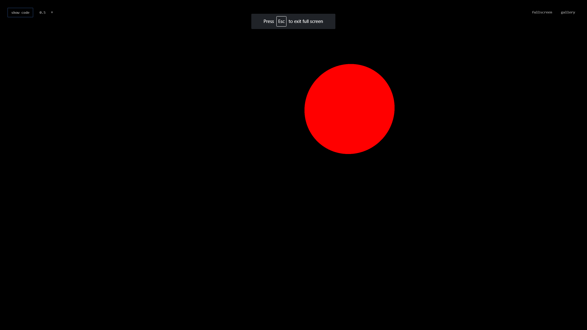
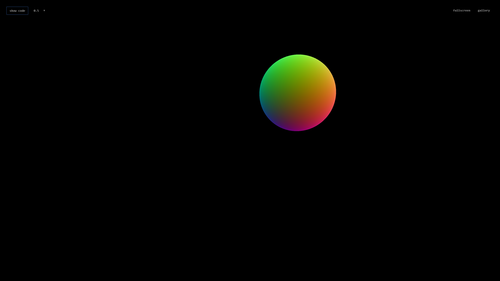
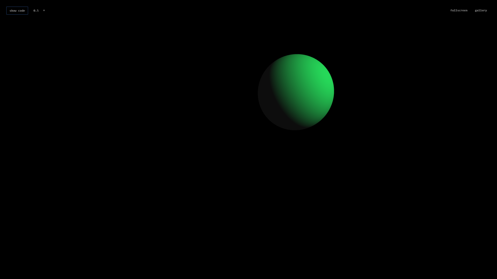
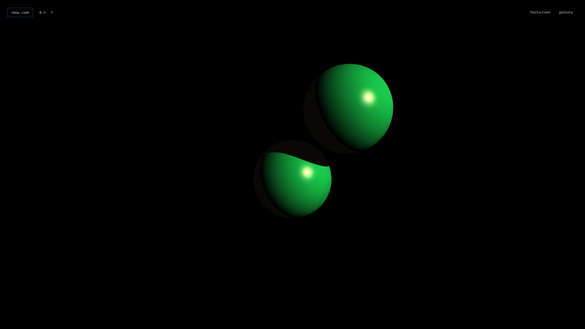
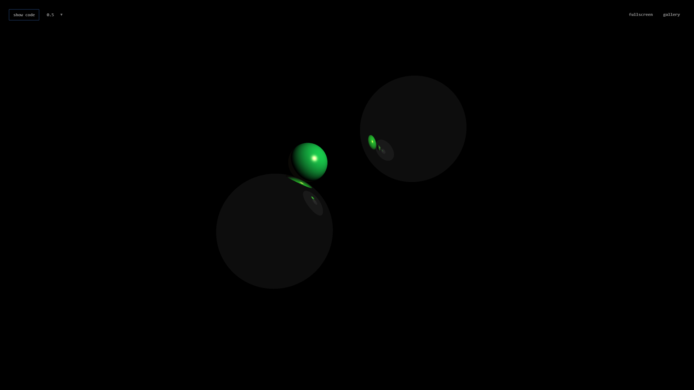
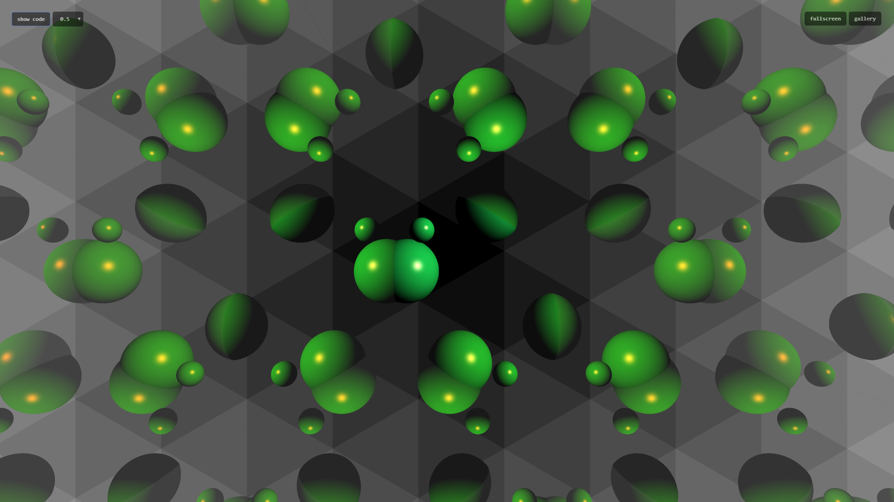

# Ray tracing

A ray tracing egy olyan grafikus algoritmus, aminek segítségével rendkívül
fotórealisztikus képeket tudunk előállítani. A ray tracing során fontos 
megérteni, hogy **nem** a fénysugarakat szimuláljuk (annak a technikának
más a neve), hanem a megfigyelési pontból (`vantage point`, `eye`, `ray origin`)
lövünk ki "sugarakat" a metaforikusan a kijelzőt ábrázoló síkra, olyan módon,
hogy minden sugár pontosan egy pixelnek fog megfelelni a végső képen, és 
ezekkel a sugarakkal keresünk mindenféle érintkezési pontot a definiált 3D
geometriával.

## Ray tracing alapok

Az algoritmus a következőképp működik:

1. Kiszámoljuk az aktuális pixel sugarát. Itt ugye a ray tracerünk fragment
shader-ben van implementálva, így minden futása a shader-nek pontosan egy
pixelnek fog megfelelni. A shader-t pedig úgy "hívjuk", hogy kirajzolunk C++
oldalon egyetlen darab teljes képernyős négyszöget (két háromszöggel), ezzel
már minden, a képernyőn látható pixel-re meg fog hívódni a shader.
2. Megnézzük, hogy a világban található objektumokkal érintkezik-e a sugár.
3. Ha igen, akkor mindenféle mást is csinálunk, majd végül valamilyen mágiával
kiszámoljuk, hogy milyen szintű a pont, és ezt visszaadjuk az OpenGL-nek.

Igen, ez egy _rendkívül felületes_ leírása az algoritmusnak, de lépésről 
lépésre fogok haladni. Először is definiáljuk, hogy mi az a "sugár".

A _sugár_ nem más, mint egy egyenes. Egészen egyszerűen megadhatjuk úgy, hogy
megadunk sugár egyenesére illeszkedő egy darab pontot, és a sugár irányvektorát.
Ebből a sugár egyenlete a következőképp elő is áll:

`p` pont: A sugár egy pontja

`v` vektor: A sugár irányvektora

A sugár egyenesén minden pont leírható úgy, hogy `p + t * v`, ahol `t` egy 
valamilyen szabadon megválasztható skalár. Amikor a sugár-objektum metszéspontokat
keressük, akkor egy egyismeretlenes egyenletrendszert oldunk meg, ahol az 
ismeretlenünk a `t`. Ebből utána visszahelyettesíthetjük a sugár egyenletébe a 
`t` értéket, és megkapjuk pontosan hol metszette a sugarunk az objektumot.

A világunkban azonban általában több objektum is található: sok gömb, sík, tükrök,
kockák, satöbbi. A metszeteket egy iterációval keressük, egyészen konkrétan arra
az egyetlen darab metszéspontra vagyunk kíváncsiak, amely esetén a `t` érték
a **legkisebb**. Hiszen ez a pont van a legközelebb a kamerához, ami emögött van,
azt a megtalált objektum eltakarja.

Most, hogy megtaláltuk, hogy a sugarunk pontosan melyik pontban metszi a geometriát,
neki kell állnunk a varázslatnak, amit úgy hívnak: `megvilágítás`. Az anyagi jellemzők
alapján 2 teljesen külön kezelendő esetre kell szétválasztanunk az algoritmusunkat:

* Ha a találati ponthoz tartozó objektum `tükrös` (jegyzetben `sima`) anyagú, akkor
sok-sok további sugárra van szükségünk ahhoz, hogy meghatározzuk a pixel színét
* Ha a találati ponthoz tartozó objektum `rücskös`, azaz nincs tükröződése, akkor
a színét a beesési szög, és a fényforrásunk(/fényforrásaink) jellemzői alapján
egyszerűen kiszámolhatjuk.

Észre lehet venni, hogy a tükrös anyagok esetén ez az algoritmus rekurzív, és csak
akkor áll le, ha a sugarunk eltalált valamit, ami rücskös. Ekkor felfelé propagálja
az eredményt addig, amíg a kiindulási sugárig el nem érünk. Természetesen implementációban
fogunk egy maximum mélységet, és egy alapértelmezett "nem talált" esetet írni, hogy
elkerüljük a végtelen rekurziót.

És akkor most rátérek arra, hogy a rücskös felületek esetén hogyan számolunk. A 
tükrös anyagok teljesen másképp működnek, azokat kicsit később írom le.

Ha eltaláltunk valamit, akkor először is meg kell nézni, hogy az adott pont árnyékban
van-e. Ugyebár ha egy másik objektum kitakarja a fényforrást az adott ponton, akkor
a pontunk árnyékban van, ellenkező esetben nincs árnyékban. Éppen ezért a találati
pontról indítunk egy újabb sugarat. Ezen sugár megadott pontja a metszéspont, iránya
pedig egy olyan vektor, amelyet a találati pont-ból húzunk a pontszerű fényforrás felé.
(Ez pontszerű fényforrást feltételez, de van többféle is, majd rátérek). Ha ez a sugár
metszi a geometriát, méghozzá **előbb**, minthogy elérnénk a fényforrást, a pont
árnyékban van, és a pixelt valami sötét színre (ambient világítás színére) színezzük.
Ha azonban nincs másodlagos találat (ezt a sugarat hívjuk egyébként `shadow ray`-nek),
akkor a pont meg van világítva, és a beesési szög koszinusza, a felület normálvektora,
és pár egyéb változó segítségével kiszámolhatjuk a színét.

A tükrös felületek kicsit trükkösebbek: Nekik nincsen "maguktól" színük. Van róluk
olyan információnk, hogy az RGB spektrumon mintavételezve mekkora a törésmutatójuk,
és a kioltási állandójuk, de a pixel színét a másodlagos, harmadlagos, ... n-edleges
találatok fogják meghatározni. Ahhoz, hogy megértsük, ez miért működik, képzeljük el
azt, hogy a fényforrásunkból elindul egy foton. Ez a foton valahol metsz egy rücskös
felületet, visszapattan, és a tükrünkre érkezik. A tükörről "tökéletesen" verődik vissza,
esetleg a tükör egy másik pontjára. Ezt addig csinálja, amíg egyszercsak elérkezik pontosan
abba a pixelbe, amit éppen nézünk. A tükrökről való pattogást nagyon egyszerű lin
algebra segítségével le tudjuk szimulálni, és kvázi ugyanazt csináltuk, mint a fény, csak
**visszafelé**. Amint elérjük a rücskös felületet, tudunk színt számolni, amit a pattogás
útvonalon visszafele viszünk, a `Fresnel-egyenlet` segítségével azt is meg tudjuk határozni,
hogy minden pattogáskor az eredeti "rücskös szín" mennyit változik, míg végül visszaérünk
a kiinduló ponthoz.

Nos, most, hogy tudjuk hogyan működik a ray tracing, írjunk is egy ray tracert! Ehhez
egy **rendkívüli módon, elképesztően nagyon hasznos** eszközt fogok bemutatni, ami
**nem** a házifeladat szkeleton, hanem egy online GLSL editor. Azért ebben mutatok példát
inkább, mint a házifeladat C++ kódban, mert amúgy is a házifeladat 90%-a az az, hogy
a ray tracert meg tudod-e írni GLSL-ben, ami körülötte van C++ kód, azt pár óra alatt
meg lehet írni. Ez az eszköz a [GLSL Sandbox](http://glslsandbox.com/). Az oldal teljesen
ugyanazt csinálja, mint majd a házid: A háttérben a teljes képernyőre kirajzol egy darab
négyzetet, van egy beégetett vertex shader-e, mi pedig megírhatjuk a fragment shader-t.
Van egy pár beépített uniform-unk, amit használhatunk:

* `uniform float time`: Ez másodpercben az oldal megnyitása óta eltelt idő
* `uniform vec2 resolution`: Ez az ablak felbontása, pixelekben
* `uniform vec2 mouse`. Ez az egér koordinátája

Ahogyan eddig is, a fragment shader `main` függvényébe kerül a magic. Nyisd meg tehát
a http://glslsandbox.com/ weboldalt, és kattints fent a `Create new effect!` gombra.

_Megjegyzés_: Ha szeretnéd, hogy ne kerüljön ki az internet-re a shader-ed, akkor egészen
egyszerűen ne kattints a `Save` gombra. Mentsd inkább el fájlba a kódot, és amikor újra
dolgozol rajta, másold be az editor-ba, így biztosan nem lopják el mások a házid :)

Ahhoz, hogy lássuk, hogy működik a fragment shader, másold be a következő kódot az editorba:

```glsl
#ifdef GL_ES
precision mediump float;
#endif

#extension GL_OES_standard_derivatives : enable

uniform float time;
uniform vec2 mouse;
uniform vec2 resolution;

void main() {

	vec2 ndc = ( gl_FragCoord.xy / resolution.xy ) * 2.0 - 1.0;

	gl_FragColor = vec4( 1.0, 0.0, 0.0, 1.0 );

}
```

Ennek a hatására a bal felső sarokban `compiled successfully` üzenetet kell, hogy láss,
és egy teljes képernyős piros téglalapot. Most kezdjünk el kicsit varázsolni. Az eszköz
automatikusan fordít, amikor változtatjuk a kódot, így láthatjuk, hogy hol vannak a fordítási
hibáink, és hogy vannak-e.

_Gyors GLSL kitérő_: Ebben a GLSL shader-ben már advanced-ebb nyelvi elemek is felhasználásra 
kerülnek az első házival ellentétben. Senkit se zavarjon meg az `in`, `out`, `struct`, satöbbi
dolgok, ezek viszonylag egyszerű dolgok. Mielőtt továbbhaladnál, ha nem ismered ezeket a GLSL
dolgokat, javaslom nézz bele a `raytracing-glsl.md` fájlba!

Kezdjük azzal, hogy a ray tracing-hez használt struktúrákat definiáljuk:

```glsl
/* Egy sugarat ír le */
struct Ray {
	vec3 origin; // A sugár egyenesének egy pontja
	vec3 direction; // A sugár iránya
};

/* Egy anyagot ír le. Később rendesen kiegészítjük majd */
struct Material {
	vec3 diffuse; // A "rücskös" színe az objektumnak
};

/* Egy sugár-objektum találatot ír le */
struct Hit {
	bool didHit; // Volt-e találat
	vec3 rayOrigin; // A találatot okozó sugár pontja
	vec3 rayDirection; // A találatot okozó sugár iránya
	float hitDistance; // A találat távolsága a sugár pontjától
	vec3 hitPoint; // A találat pontja a világ koordináta rendszerében
	vec3 hitNormal; // Az eltalált felület pontbeli normálvektora
	int hitMaterialId; // Az eltalált objektum anyagának azonosítója
};
```

Ha minden sikeresen lefordult, akkor csináljunk egy gömb-sugár metszést:

```glsl
void intersectSphere (in Ray ray, in vec4 sphere, out Hit hit) {

	// A gömb egyenlete egy másodfokú egyenlet a következő alakban:
	// (x - x0)^2 + (y - y0)^2 + (z - z0)^2 = r^2
	// Az (x0, y0, z0) vektor a gömb középpontja, az r a gömb sugara
	// Jelen esetben a gömböt egy 4 dimenziós vektorként vesszük át
	// Az első három koordinátája a vektornak a gömb középpontja,
	// a negyedik a gömb sugara
	// Akkor talál a sugár, ha a sugár egyenesének egyenletéből, 
	// és a gömb egyenletéből csinálunk egy egyenletrendszert, 
	// megoldjuk, és olyan t értéket kapunk, amely a sugár irányában
	// pozitív, és amúgy a másodfokú egyenletben a diszkrimináns >0 volt

	hit.rayOrigin = ray.origin;
    hit.rayDirection = ray.direction;
    
    vec3 dist = ray.origin - sphere.xyz;
    
    float a = dot (ray.direction, ray.direction);
    float b = dot (dist, ray.direction) * 2.0;
    float c = dot (dist, dist) - sphere.w * sphere.w;
    float discr = b * b - 4.0 * a * c;
    
    if (discr < 0.0) {
        hit.didHit = false;
        return;
    }
    
    float sqrt_discr = sqrt (discr);
    float t1 = (-b + sqrt_discr) / 2.0 / a;
    float t2 = (-b - sqrt_discr) / 2.0 / a;
    
    if (t1 <= 0.0) {
        hit.didHit = false;
        return;
    }
    
    float hitT = (t2 > 0.0) ? t2 : t1;
    
    // Itt biztosan volt találat
    hit.didHit = true;

    // Találati pont az egyenletrendszerből kiszámított t érték segítségével
    hit.hitPoint = ray.origin + ray.direction * hitT;

    // A gömb normálvektora nagyon egyszerű: Összekötjük a gömb középpontját
    // a találati ponttal, és normalizáljuk
    hit.hitNormal = normalize ((hit.hitPoint - sphere.xyz));

    // Anyagokkal még nem foglalkozunkm állítsuk 0-ra
    hit.hitMaterialId = 0;
    hit.hitDistance = hitT;

}
```

Ezzel a kódrészlettel már képesek vagyunk gömb-sugár metszéspontok keresésére.
Ahhoz azonban, hogy bármilyen képet csinálhassunk ray tracing segítségével, először
a sugarainkat is le kell tudnunk generálni. Erre kétféle megoldást fogok bemutatni:
Először az egyszerű megoldást, ami nem biztos, hogy teljesen megfelelő lesz a
házifeladatban, de kiindulási pontnak jó, majd a tutorial végén megmutatom, hogy rendesen
hogy lehet ezt csinálni. Szóval egyellőre a sugarakat úgy fogjuk kilőni, hogy a
near plane-ünk (a generált képhez tartozó, 3D-ben elhelyezett téglalap) a `Z = 0` 
sík, ezen a síkon az egy pixelhez tartozó pontunkat `vec3 (ndc.x, ndc.y, 0.0)`-val
definiáljuk, ezt a pontot és a kamerapontot összekötjük, majd normalizáljuk, és 
készen is van a sugár irányvektora. A sugár pontja természetesen a kamerapont lesz:

```glsl
// Mozgassuk a kamerát kicsit hátrébb a Z tengelyen
const vec3 cameraPosition = vec3 (0.0, 0.0, -2.0);

void getRay (in vec2 ndc, out Ray ray) {

	ray.origin = cameraPosition;
	ray.direction = normalize ( vec3 (ndc.x, ndc.y, 0.0) - cameraPosition );

}
```

És most pedig összerakjuk a ray tracert (egyellőre világítás nélkül):

## Az első ray tracer-ed

```glsl
#ifdef GL_ES
precision mediump float;
#endif

#extension GL_OES_standard_derivatives : enable

uniform float time;
uniform vec2 mouse;
uniform vec2 resolution;

/* Egy sugarat ír le */
struct Ray {
	vec3 origin; // A sugár egyenesének egy pontja
	vec3 direction; // A sugár iránya
};

/* Egy anyagot ír le. Később rendesen kiegészítjük majd */
struct Material {
	vec3 diffuse; // A "rücskös" színe az objektumnak
};

/* Egy sugár-objektum találatot ír le */
struct Hit {
	bool didHit; // Volt-e találat
	vec3 rayOrigin; // A találatot okozó sugár pontja
	vec3 rayDirection; // A találatot okozó sugár iránya
	float hitDistance; // A találat távolsága a sugár pontjától
	vec3 hitPoint; // A találat pontja a világ koordináta rendszerében
	vec3 hitNormal; // Az eltalált felület pontbeli normálvektora
	int hitMaterialId; // Az eltalált objektum anyagának azonosítója
};
	
void intersectSphere (in Ray ray, in vec4 sphere, out Hit hit) {

	// A gömb egyenlete egy másodfokú egyenlet a következő alakban:
	// (x - x0)^2 + (y - y0)^2 + (z - z0)^2 = r^2
	// Az (x0, y0, z0) vektor a gömb középpontja, az r a gömb sugara
	// Jelen esetben a gömböt egy 4 dimenziós vektorként vesszük át
	// Az első három koordinátája a vektornak a gömb középpontja,
	// a negyedik a gömb sugara
	// Akkor talál a sugár, ha a sugár egyenesének egyenletéből, 
	// és a gömb egyenletéből csinálunk egy egyenletrendszert, 
	// megoldjuk, és olyan t értéket kapunk, amely a sugár irányában
	// pozitív, és amúgy a másodfokú egyenletben a diszkrimináns >0 volt

    hit.rayOrigin = ray.origin;
    hit.rayDirection = ray.direction;
    
    vec3 dist = ray.origin - sphere.xyz;
    
    float a = dot (ray.direction, ray.direction);
    float b = dot (dist, ray.direction) * 2.0;
    float c = dot (dist, dist) - sphere.w * sphere.w;
    float discr = b * b - 4.0 * a * c;
    
    if (discr < 0.0) {
        hit.didHit = false;
        return;
    }
    
    float sqrt_discr = sqrt (discr);
    float t1 = (-b + sqrt_discr) / 2.0 / a;
    float t2 = (-b - sqrt_discr) / 2.0 / a;
    
    if (t1 <= 0.0) {
        hit.didHit = false;
        return;
    }
    
    float hitT = (t2 > 0.0) ? t2 : t1;
    
    hit.didHit = true;
    hit.hitPoint = ray.origin + ray.direction * hitT;
    hit.hitNormal = normalize ((hit.hitPoint - sphere.xyz));
    hit.hitMaterialId = 0;
    hit.hitDistance = hitT;

}

// Mozgassuk a kamerát kicsit hátrébb a Z tengelyen
const vec3 cameraPosition = vec3 (0.0, 0.0, -2.0);

void getRay (in vec2 ndc, out Ray ray) {

	ray.origin = cameraPosition;
	ray.direction = normalize ( vec3 (ndc.x, ndc.y, 0.0) - cameraPosition );

}

// Ez a ray tracing "fő függvénye"
// Bemenetként az NDC koordinátákat kapja meg, ebből
// generálja a sugarat, végignézi az objektumokkal
// a metszétpontokat, igény szerint majd további sugarakat
// fog kilőni, satöbbi.
// A függvény visszatérési értéke a végső pixel szín
vec4 rayTrace (in vec2 ndc) {
	
	Ray ray;
	getRay (ndc, ray);
	
	Hit hit;
	intersectSphere (
		ray,
		vec4 (1.0, 1.0, 4.0, 0.8),
		hit
	);
	
	if (hit.didHit) {
		return vec4 (1.0, 0.0, 0.0, 1.0);
	} else {
		return vec4 (0.0, 0.0, 0.0, 1.0);
	}
	
}

void main() {

	// Normalized Device Coordinates: x és y [-1, 1] intervallumban
	vec2 ndc = ( gl_FragCoord.xy / resolution.xy ) * 2.0 - 1.0;
	
	// Javítás szélesvásznú kijelzőkön
	float aspect = resolution.x / resolution.y;
	ndc.x *= aspect;
	
	gl_FragColor = rayTrace (ndc);

}
```

Ha ezt bemásolod az editorban, akkor a képernyő közepétől kicsit jobbra-fel irányban
meg kellett, hogy jelenlen egy piros gömb. Gratulálok! Kész az első ray tracer-ed!
Most jön az igazi **MÓKA**, amikor is ebből rendes ray tracer-t csinálunk.



Most egy kicsit érdekesebb képet fogunk generálni, ugyanis érdemes leellenőrizni, 
hogy a ray tracerünk valóban jól működik, ehhez meg fogjuk nézni, hogy a normálvektorokat
is jól adja-e vissza. Így tehát a `return vec4 (1.0, 0.0, 0.0, 1.0);` sort cseréljük
le erre: `return vec4 (hit.hitNormal * 0.5 + 0.5, 1.0);`. Ha jól csináltál mindent,
akkor a gömb már sokkal színesebb, bal alsó tájékán kékes, jobb felső tájékán sárga
színű.



## Első lépés: Rücskös anyagok, és világítás

Kétféle fényforrást fogunk vizsgálni:

* _Pontszerű fényforrás_: A fénynek van egy kiinduló pontja, e pont körül minden
irányba azonos mennyiségű fényt bocsát ki. Ilyen például egy villanykörte.
* _Irányított fényforrás_: A fénysugaraknak nincsen kiinduló pontja, vagy ez a
pont annyira messze van, hogy mire ideér a fény, minden fénysugár párhuzamosan
halad. Ilyen például a nap is.

Mindkét esetben a fénynek van még két extra tulajdonsága:

* _Környezeti világítás_: Minden _jelenetben_ meg van határozva, hogy bármely
pontot a környezet mennyire világít meg. Ezt a fényt konstansnak vesszük.
* _Energia_: A fénynek van egy energiája, amivel tudunk majd számolni. Ezt
nevezhetjük energiának, radianciának, de **SEMMILYEN LEGVÉGSŐ ESETBEN** se
nevezzük _színnek_, mert attól egészen biztosan agyérgörcsöt kap, aki javítja
a házit.

A megvilágítás mennyiségét egy adott találati ponton a következőképp számoljuk:

`Radiancia = Környezeti világítás + rücskös világítás + spekuláris komponens`.

A képletben a `környezeti világítás` rész a legegyszerűbb, ez egy előre meghatározott
konstans, esetleg megszorozhatjuk valami anyagra jellemző tulajdonsággal.

A `rücskös világítás` kiszámolásához szükségünk van a diffúz színére (elnyelő képessége
helyesebben) az anyagnak, a fény beesési szögére, amit a pontbeli normálvektor 
segítségével számolunk ki, és ennyi. 

Irányított fényforrás esetén a következőképp számolhatunk:

```glsl

// A radiancia nulláról indul
vec3 totalRadiance = vec3 (0.0, 0.0, 0.0);

Hit hit;
// ... ray tracing ...

if (hit.didHit) {

	// Természetesen kelleni fog ez a függvény is majd
	Material mat = getMaterialById (hit.hitMaterialId);

	// A környezeti fény szorozva az anyag környezeti fényelnyelő-képességével
	totalRadiance += lightAmbient * mat.ambient;

	// Beesési szög koszinusza
	float cosTheta = dot (hit.hitNormal, lightDirection);

	// Ha kisebb, mint 0 akkor a másik oldalán van a fénynek,
	// így árnyékban van
	if (cosTheta > 0.0) {
		totalRadiance += lightEnergy * mat.diffuse * cosTheta;
	}

}

finalColor = totalRadiance;

```

Ha ezt szépen összepakoljuk egy rendesen implementált shader-be, a következő
kódot kapjuk:

```glsl
#ifdef GL_ES
precision mediump float;
#endif

#extension GL_OES_standard_derivatives : enable

uniform float time;
uniform vec2 mouse;
uniform vec2 resolution;

// --- Struktúrák ---

/* Egy sugarat ír le */
struct Ray {
	vec3 origin; // A sugár egyenesének egy pontja
	vec3 direction; // A sugár iránya
};

/* Egy anyagot ír le. Később rendesen kiegészítjük majd */
struct Material {
	vec3 ambient; // Az anyag környezeti világítás elnyelőképessége
	vec3 diffuse; // A "rücskös" színe az objektumnak
};

/* Egy sugár-objektum találatot ír le */
struct Hit {
	bool didHit; // Volt-e találat
	vec3 rayOrigin; // A találatot okozó sugár pontja
	vec3 rayDirection; // A találatot okozó sugár iránya
	float hitDistance; // A találat távolsága a sugár pontjától
	vec3 hitPoint; // A találat pontja a világ koordináta rendszerében
	vec3 hitNormal; // Az eltalált felület pontbeli normálvektora
	int hitMaterialId; // Az eltalált objektum anyagának azonosítója
};

struct Light {
	int type;
	vec3 position;
	vec3 direction;
	vec3 energy;
};
	
// --- Konstansok ---

// Mozgassuk a kamerát kicsit hátrébb a Z tengelyen
const vec3 cameraPosition = vec3 (0.0, 0.0, -2.0);

const int LIGHT_POINT = 1;
const int LIGHT_DIRECTIONAL = 2;
const vec3 lightAmbient = vec3 (0.05, 0.05, 0.05);
const Light light = Light (
	LIGHT_DIRECTIONAL, // Irányított fényforrás
	vec3 (0.0), // Irányított, így nincs pozíció
	normalize (vec3 (1.0, 0.5, -1.0)), // A fény iránya
	vec3 (1.0, 1.0, 1.0) // A fény energiája. Jelen esetben ez "fehér fény"
);

// --- Függvények ---
Material getMaterialById (int id) {
	
	// 0-ás legyen valami zöldes színű
	if (id == 0) {
		return Material (
			vec3 (0.8, 0.6, 0.4),
			vec3 (0.1, 0.8, 0.3)
		);
	}
	
	// Alapértelmezett legyen valami kékes
	return Material (
		vec3 (0.4, 0.6, 0.8),
		vec3 (0.05, 0.3, 0.8)
	);
}
	
void intersectSphere (in Ray ray, in vec4 sphere, out Hit hit) {

	// A gömb egyenlete egy másodfokú egyenlet a következő alakban:
	// (x - x0)^2 + (y - y0)^2 + (z - z0)^2 = r^2
	// Az (x0, y0, z0) vektor a gömb középpontja, az r a gömb sugara
	// Jelen esetben a gömböt egy 4 dimenziós vektorként vesszük át
	// Az első három koordinátája a vektornak a gömb középpontja,
	// a negyedik a gömb sugara
	// Akkor talál a sugár, ha a sugár egyenesének egyenletéből, 
	// és a gömb egyenletéből csinálunk egy egyenletrendszert, 
	// megoldjuk, és olyan t értéket kapunk, amely a sugár irányában
	// pozitív, és amúgy a másodfokú egyenletben a diszkrimináns >0 volt

	hit.rayOrigin = ray.origin;
	hit.rayDirection = ray.direction;
	
	vec3 dist = ray.origin - sphere.xyz;
	
	float a = dot (ray.direction, ray.direction);
	float b = dot (dist, ray.direction) * 2.0;
	float c = dot (dist, dist) - sphere.w * sphere.w;
	float discr = b * b - 4.0 * a * c;
	
	if (discr < 0.0) {
		hit.didHit = false;
		return;
	}
	
	float sqrt_discr = sqrt (discr);
	float t1 = (-b + sqrt_discr) / 2.0 / a;
	float t2 = (-b - sqrt_discr) / 2.0 / a;
	
	if (t1 <= 0.0) {
		hit.didHit = false;
		return;
	}
	
	float hitT = (t2 > 0.0) ? t2 : t1;
	
	hit.didHit = true;
	hit.hitPoint = ray.origin + ray.direction * hitT;
	hit.hitNormal = normalize ((hit.hitPoint - sphere.xyz));
	
	hit.hitMaterialId = 0;
	hit.hitDistance = hitT;

}

void getRay (in vec2 ndc, out Ray ray) {

	ray.origin = cameraPosition;
	ray.direction = normalize ( vec3 (ndc.x, ndc.y, 0.0) - cameraPosition );

}

// Ez a ray tracing "fő függvénye"
// Bemenetként az NDC koordinátákat kapja meg, ebből
// generálja a sugarat, végignézi az objektumokkal
// a metszétpontokat, igény szerint majd további sugarakat
// fog kilőni, satöbbi.
// A függvény visszatérési értéke a végső pixel szín
vec4 rayTrace (in vec2 ndc) {
	
	Ray ray;
	getRay (ndc, ray);
	
	Hit hit;
	intersectSphere (
		ray,
		vec4 (1.0, 1.0, 4.0, 0.8),
		hit
	);
	
	vec3 totalRadiance = vec3 (0.0);
	
	if (hit.didHit) {
		
		Material mat = getMaterialById (hit.hitMaterialId);
		
		totalRadiance += lightAmbient;
		
		float cosTheta = 0.0;
		
		if (light.type == LIGHT_POINT) {
			cosTheta = dot (hit.hitNormal, normalize (hit.hitPoint - light.position));
		} else if (light.type == LIGHT_DIRECTIONAL) {
			cosTheta = dot (hit.hitNormal, light.direction);
		}
		
		if (cosTheta > 0.0) {
			totalRadiance += light.energy * mat.diffuse * cosTheta;
		}
		
	}
	
	return vec4 (totalRadiance, 1.0);
	
	
}

void main() {

	// Normalized Device Coordinates: x és y [-1, 1] intervallumban
	vec2 ndc = ( gl_FragCoord.xy / resolution.xy ) * 2.0 - 1.0;
	
	// Javítás szélesvásznú kijelzőkön
	float aspect = resolution.x / resolution.y;
	ndc.x *= aspect;
	
	gl_FragColor = rayTrace (ndc);

}
```



Ezzel készen is van az egyetlen gömbünk diffúz megvilágítása! Most adjuk
hozzá a `Blinn-Phong` technika által leírt spekuláris komponenst. Ehhez
az `if (cosTheta > 0.0)` ágat egészítjük egy kicsit ki:

```glsl
if (cosTheta > 0.0) {
	totalRadiance += light.energy * mat.diffuse * cosTheta;

	vec3 halfway = vec3 (0.0);

	if (light.type == LIGHT_POINT) {
		halfway = normalize (-hit.rayDirection + normalize (hit.hitPoint - light.position));
	} else {
		halfway = normalize (-hit.rayDirection + light.direction);
	}

	float cosDelta = dot (hit.hitNormal, halfway);
	if (cosDelta > 0.0) {
		totalRadiance += light.energy * pow (cosDelta, 50.0);
	}

}
```


Amint láthatjuk, megjelent egy kis fehér valami a gömbünkön, ha így történt,
akkor nagyon jól állunk, már csak kicsit alakítgatunk a struktúrákon, hogy
ne beégetett értékekkel számoljunk, hanem legyenek extra anyagi tulajdonságaink
a spekuláris komponens számításához:

```glsl
struct Material {
	vec3 ambient;
	vec3 diffuse;
	vec3 specular;
	float shininess;
};
```

és

```glsl
totalRadiance += light.energy * mat.specular * pow (cosDelta, mat.shininess);
```

Ha minden fordítási hibát kijavítasz, akkor jelenleg a következő shader kódot
nézed:

```glsl
#ifdef GL_ES
precision mediump float;
#endif

#extension GL_OES_standard_derivatives : enable

uniform float time;
uniform vec2 mouse;
uniform vec2 resolution;

// --- Struktúrák ---

/* Egy sugarat ír le */
struct Ray {
	vec3 origin; // A sugár egyenesének egy pontja
	vec3 direction; // A sugár iránya
};

/* Egy anyagot ír le. Később rendesen kiegészítjük majd */
struct Material {
	vec3 ambient;
	vec3 diffuse;
	vec3 specular;
	float shininess;
};

/* Egy sugár-objektum találatot ír le */
struct Hit {
	bool didHit; // Volt-e találat
	vec3 rayOrigin; // A találatot okozó sugár pontja
	vec3 rayDirection; // A találatot okozó sugár iránya
	float hitDistance; // A találat távolsága a sugár pontjától
	vec3 hitPoint; // A találat pontja a világ koordináta rendszerében
	vec3 hitNormal; // Az eltalált felület pontbeli normálvektora
	int hitMaterialId; // Az eltalált objektum anyagának azonosítója
};

struct Light {
	int type;
	vec3 position;
	vec3 direction;
	vec3 energy;
};
	
// --- Konstansok ---

// Mozgassuk a kamerát kicsit hátrébb a Z tengelyen
const vec3 cameraPosition = vec3 (0.0, 0.0, -2.0);

const int LIGHT_POINT = 1;
const int LIGHT_DIRECTIONAL = 2;
const vec3 lightAmbient = vec3 (0.05, 0.05, 0.05);
const Light light = Light (
	LIGHT_DIRECTIONAL, // Irányított fényforrás
	vec3 (0.0), // Irányított, így nincs pozíció
	normalize (vec3 (1.0, 0.5, -1.0)), // A fény iránya
	vec3 (1.0, 1.0, 1.0) // A fény energiája. Jelen esetben ez "fehér fény"
);

// --- Függvények ---
Material getMaterialById (int id) {
	
	// 0-ás legyen valami zöldes színű
	if (id == 0) {
		return Material (
			vec3 (0.8, 0.6, 0.4),
			vec3 (0.1, 0.8, 0.3),
			vec3 (1.0, 0.5, 0.5),
			100.0
		);
	}
	
	// Alapértelmezett legyen valami kékes
	return Material (
		vec3 (0.4, 0.6, 0.8),
		vec3 (0.05, 0.3, 0.8),
		vec3 (0.0),
		0.0
	);
}
	
void intersectSphere (in Ray ray, in vec4 sphere, out Hit hit) {

	// A gömb egyenlete egy másodfokú egyenlet a következő alakban:
	// (x - x0)^2 + (y - y0)^2 + (z - z0)^2 = r^2
	// Az (x0, y0, z0) vektor a gömb középpontja, az r a gömb sugara
	// Jelen esetben a gömböt egy 4 dimenziós vektorként vesszük át
	// Az első három koordinátája a vektornak a gömb középpontja,
	// a negyedik a gömb sugara
	// Akkor talál a sugár, ha a sugár egyenesének egyenletéből, 
	// és a gömb egyenletéből csinálunk egy egyenletrendszert, 
	// megoldjuk, és olyan t értéket kapunk, amely a sugár irányában
	// pozitív, és amúgy a másodfokú egyenletben a diszkrimináns >0 volt

	hit.rayOrigin = ray.origin;
	hit.rayDirection = ray.direction;
	
	vec3 dist = ray.origin - sphere.xyz;
	
	float a = dot (ray.direction, ray.direction);
	float b = dot (dist, ray.direction) * 2.0;
	float c = dot (dist, dist) - sphere.w * sphere.w;
	float discr = b * b - 4.0 * a * c;
	
	if (discr < 0.0) {
		hit.didHit = false;
		return;
	}
	
	float sqrt_discr = sqrt (discr);
	float t1 = (-b + sqrt_discr) / 2.0 / a;
	float t2 = (-b - sqrt_discr) / 2.0 / a;
	
	if (t1 <= 0.0) {
		hit.didHit = false;
		return;
	}
	
	float hitT = (t2 > 0.0) ? t2 : t1;
	
	hit.didHit = true;
	hit.hitPoint = ray.origin + ray.direction * hitT;
	hit.hitNormal = normalize ((hit.hitPoint - sphere.xyz));
	
	hit.hitMaterialId = 0;
	hit.hitDistance = hitT;

}

void getRay (in vec2 ndc, out Ray ray) {

	ray.origin = cameraPosition;
	ray.direction = normalize ( vec3 (ndc.x, ndc.y, 0.0) - cameraPosition );

}

// Ez a ray tracing "fő függvénye"
// Bemenetként az NDC koordinátákat kapja meg, ebből
// generálja a sugarat, végignézi az objektumokkal
// a metszétpontokat, igény szerint majd további sugarakat
// fog kilőni, satöbbi.
// A függvény visszatérési értéke a végső pixel szín
vec4 rayTrace (in vec2 ndc) {
	
	Ray ray;
	getRay (ndc, ray);
	
	Hit hit;
	intersectSphere (
		ray,
		vec4 (1.0, 1.0, 4.0, 0.8),
		hit
	);
	
	vec3 totalRadiance = vec3 (0.0);
	
	if (hit.didHit) {
		
		Material mat = getMaterialById (hit.hitMaterialId);
		
		totalRadiance += lightAmbient;
		
		float cosTheta = 0.0;
		
		if (light.type == LIGHT_POINT) {
			cosTheta = dot (hit.hitNormal, normalize (hit.hitPoint - light.position));
		} else if (light.type == LIGHT_DIRECTIONAL) {
			cosTheta = dot (hit.hitNormal, light.direction);
		}
		
		if (cosTheta > 0.0) {
			totalRadiance += light.energy * mat.diffuse * cosTheta;
		
			vec3 halfway = vec3 (0.0);
		
			if (light.type == LIGHT_POINT) {
				halfway = normalize (-hit.rayDirection + normalize (hit.hitPoint - light.position));
			} else {
				halfway = normalize (-hit.rayDirection + light.direction);
			}
		
			float cosDelta = dot (hit.hitNormal, halfway);
			if (cosDelta > 0.0) {
				totalRadiance += light.energy * mat.specular * pow (cosDelta, mat.shininess);
			}
		
		}
		
	}
	
	return vec4 (totalRadiance, 1.0);
	
	
}

void main() {

	// Normalized Device Coordinates: x és y [-1, 1] intervallumban
	vec2 ndc = ( gl_FragCoord.xy / resolution.xy ) * 2.0 - 1.0;
	
	// Javítás szélesvásznú kijelzőkön
	float aspect = resolution.x / resolution.y;
	ndc.x *= aspect;
	
	gl_FragColor = rayTrace (ndc);

}
```

Most rátérhetünk végre arra, hogy hogyan lesznek árnyékaink, és tükröződéseink!

## Árnyékok, tükröződések

Világos, hogy a jelenlegi ray tracer-ünk sajnos még nem igazán kezeli a fény
pattogását. Ezt úgy fogjuk megjavítani, hogy belekódoljuk azt, hogy kezelje
a fény pattogását :).

Két esetünk lesz:

* rücskös felületek esetén minden találati pontból indítanunk kell a fényforrás
felé egy ún. "shadow ray"-t. Ha ez a shadow ray valamivel ütközik, akkor a fényforrás
takart, és árnyékban vagyunk
* sima felületek esetén indítunk egy ún. "reflection ray"-t. Ezt úgy számoljuk ki,
hogy a reflection ray, és az eredeti ray beesési szöge megegyezik, így csinálunk
tükröződést. Ezzel a reflection ray-el ismét lefuttatjuk a ray tracing-et, és kezdjük
elölről. 

GLSL-ben nem szerencsés rekurziót csinálni, így ehelyett ezt iteratív módon fogjuk
megcsinálni:

```glsl
#ifdef GL_ES
precision mediump float;
#endif

#extension GL_OES_standard_derivatives : enable

uniform float time;
uniform vec2 mouse;
uniform vec2 resolution;

// --- Struktúrák ---

/* Egy sugarat ír le */
struct Ray {
	vec3 origin; // A sugár egyenesének egy pontja
	vec3 direction; // A sugár iránya
};

/* Egy anyagot ír le. Később rendesen kiegészítjük majd */
struct Material {
	vec3 ambient;
	vec3 diffuse;
	vec3 specular;
	float shininess;
};

/* Egy sugár-objektum találatot ír le */
struct Hit {
	bool didHit; // Volt-e találat
	vec3 rayOrigin; // A találatot okozó sugár pontja
	vec3 rayDirection; // A találatot okozó sugár iránya
	float hitDistance; // A találat távolsága a sugár pontjától
	vec3 hitPoint; // A találat pontja a világ koordináta rendszerében
	vec3 hitNormal; // Az eltalált felület pontbeli normálvektora
	int hitMaterialId; // Az eltalált objektum anyagának azonosítója
};

struct Light {
	int type;
	vec3 position;
	vec3 direction;
	vec3 energy;
};
	
// --- Konstansok ---

// Mozgassuk a kamerát kicsit hátrébb a Z tengelyen
const vec3 cameraPosition = vec3 (0.0, 0.0, -2.0);

const int LIGHT_POINT = 1;
const int LIGHT_DIRECTIONAL = 2;
const vec3 lightAmbient = vec3 (0.05, 0.05, 0.05);
const Light light = Light (
	LIGHT_DIRECTIONAL, // Irányított fényforrás
	vec3 (0.0), // Irányított, így nincs pozíció
	normalize (vec3 (1.0, 0.5, -1.0)), // A fény iránya
	vec3 (1.0, 1.0, 1.0) // A fény energiája. Jelen esetben ez "fehér fény"
);

// --- Függvények ---
Material getMaterialById (int id) {
	
	// 0-ás legyen valami zöldes színű
	if (id == 0) {
		return Material (
			vec3 (0.8, 0.6, 0.4),
			vec3 (0.1, 0.8, 0.3),
			vec3 (1.0, 0.5, 0.5),
			100.0
		);
	}
	
	// Alapértelmezett legyen valami kékes
	return Material (
		vec3 (0.4, 0.6, 0.8),
		vec3 (0.05, 0.3, 0.8),
		vec3 (0.0),
		0.0
	);
}
	
void intersectSphere (in Ray ray, in vec4 sphere, out Hit hit) {

	// A gömb egyenlete egy másodfokú egyenlet a következő alakban:
	// (x - x0)^2 + (y - y0)^2 + (z - z0)^2 = r^2
	// Az (x0, y0, z0) vektor a gömb középpontja, az r a gömb sugara
	// Jelen esetben a gömböt egy 4 dimenziós vektorként vesszük át
	// Az első három koordinátája a vektornak a gömb középpontja,
	// a negyedik a gömb sugara
	// Akkor talál a sugár, ha a sugár egyenesének egyenletéből, 
	// és a gömb egyenletéből csinálunk egy egyenletrendszert, 
	// megoldjuk, és olyan t értéket kapunk, amely a sugár irányában
	// pozitív, és amúgy a másodfokú egyenletben a diszkrimináns >0 volt

	hit.rayOrigin = ray.origin;
	hit.rayDirection = ray.direction;
	
	vec3 dist = ray.origin - sphere.xyz;
	
	float a = dot (ray.direction, ray.direction);
	float b = dot (dist, ray.direction) * 2.0;
	float c = dot (dist, dist) - sphere.w * sphere.w;
	float discr = b * b - 4.0 * a * c;
	
	if (discr < 0.0) {
		hit.didHit = false;
		return;
	}
	
	float sqrt_discr = sqrt (discr);
	float t1 = (-b + sqrt_discr) / 2.0 / a;
	float t2 = (-b - sqrt_discr) / 2.0 / a;
	
	if (t1 <= 0.0) {
		hit.didHit = false;
		return;
	}
	
	float hitT = (t2 > 0.0) ? t2 : t1;
	
	hit.didHit = true;
	hit.hitPoint = ray.origin + ray.direction * hitT;
	hit.hitNormal = normalize ((hit.hitPoint - sphere.xyz));
	
	hit.hitMaterialId = 0;
	hit.hitDistance = hitT;

}

void getRay (in vec2 ndc, out Ray ray) {

	ray.origin = cameraPosition;
	ray.direction = normalize ( vec3 (ndc.x, ndc.y, 0.0) - cameraPosition );

}

void intersectScene (in Ray ray, out Hit hit) {

	Hit finalHit;
	finalHit.didHit = false;

	// Első gömb
	Hit firstSphereHit;
	intersectSphere (ray, vec4 (1.0, 1.0, 4.0, 0.8), firstSphereHit);

	if (firstSphereHit.didHit) {
		if (!finalHit.didHit || finalHit.hitDistance > firstSphereHit.hitDistance) {
			finalHit = firstSphereHit;
		}
	}

	// Második gömb
	Hit secondSphereHit;
	intersectSphere (ray, vec4 (0.0, -0.3, 4.8, 0.8), secondSphereHit);

	if (secondSphereHit.didHit) {
		if (!finalHit.didHit || finalHit.hitDistance > secondSphereHit.hitDistance) {
			finalHit = secondSphereHit;
		}
	}

	// A kimeneti változót beállítjuk a legközelebbi találatra
	hit = finalHit;

}

const int maxBounces = 64;
const float EPSILON = 0.001;

vec4 rayTrace (in vec2 ndc) {

	// Ez az elsődleges, a kamerából indított sugár
	Ray primaryRay;
	
	getRay (ndc, primaryRay);

	// Ez a tükröződések "elhalványosítására" szolgál
	vec3 weight = vec3 (1.0);

	// A végső kiszámolt radiancia
	vec3 radiance = vec3 (0.0);

	Ray ray = primaryRay;

	for (int i = 0; i < maxBounces; i++) {

		Hit hit;
		
		// Keressünk találatot
		intersectScene (ray, hit);

		if (hit.didHit) {

			Material mat = getMaterialById (hit.hitMaterialId);

			Ray shadowRay;

			// Kicsit odébbról indítsuk
			shadowRay.origin = hit.hitPoint + EPSILON * hit.hitNormal;

			if (light.type == LIGHT_POINT) {
				shadowRay.direction = normalize (hit.hitPoint - light.position);
			} else if (light.type == LIGHT_DIRECTIONAL) {
				shadowRay.direction = light.direction;
			}

			Hit shadowHit;
			intersectScene (shadowRay, shadowHit);

			if (shadowHit.didHit) {

				// Árnyékban vagyunk, csak környezeti világítás van
				radiance = lightAmbient * mat.ambient;

			} else {

				float cosTheta = 0.0;
				
				// Nem vagyunk árnyékban, számolhatunk tovább!
				if (light.type == LIGHT_POINT) {
					cosTheta = dot (hit.hitNormal, normalize (hit.hitPoint - light.position));
				} else if (light.type == LIGHT_DIRECTIONAL) {
					cosTheta = dot (hit.hitNormal, light.direction);
				}
				
				if (cosTheta > 0.0) {
					radiance += light.energy * mat.diffuse * cosTheta;
				
					vec3 halfway = vec3 (0.0);
				
					if (light.type == LIGHT_POINT) {
						halfway = normalize (-hit.rayDirection + normalize (hit.hitPoint - light.position));
					} else {
						halfway = normalize (-hit.rayDirection + light.direction);
					}
				
					float cosDelta = dot (hit.hitNormal, halfway);
					if (cosDelta > 0.0) {
						radiance += light.energy * mat.specular * pow (cosDelta, mat.shininess);
					}
				
				}

			}

			// Egyellőre itt is break-elünk, majd sima
			// material-ok esetén lesz további teendő
			break;

		} else {
			// Nem találtunk el semmit, megállunk
			break;
		}

	}

	return vec4 (radiance, 1.0);

}

void main() {

	// Normalized Device Coordinates: x és y [-1, 1] intervallumban
	vec2 ndc = ( gl_FragCoord.xy / resolution.xy ) * 2.0 - 1.0;
	
	// Javítás szélesvásznú kijelzőkön
	float aspect = resolution.x / resolution.y;
	ndc.x *= aspect;
	
	gl_FragColor = rayTrace (ndc);

}

```



Láthatjuk, hogy így már két gömbünk van, és az egyikre árnyékot vet a másik.
Most csináljunk tükrös anyagokat! Ehhez szükségünk lesz egy pár dologra:

* Fresnel-egyenlet implementáció
* Material-t át kell kicsit alakítani
* és kb ennyi

A Fresnel-egyenlet rendkívül egyszerű GLSL-ben:

```glsl
struct Material {
	bool isReflective;
	vec3 ambient;
	vec3 diffuse;
	vec3 specular;
	float shininess;
	vec3 n;
	vec3 k;
};

// Megyjegyzés: Az F0 értékeket érdemes előre papíron kiszámolni,
// és a Material-ba inkább azt rakni n/k helyett, mert csak az kell
vec3 getMaterialF0 (in Material mat) {
    return vec3 (
        (pow (mat.n.x - 1.0, 2.0) + pow (mat.k.x, 2.0)) / (pow (mat.n.x + 1.0, 2.0) + pow (mat.k.x, 2.0)),
        (pow (mat.n.y - 1.0, 2.0) + pow (mat.k.y, 2.0)) / (pow (mat.n.y + 1.0, 2.0) + pow (mat.k.y, 2.0)),
        (pow (mat.n.z - 1.0, 2.0) + pow (mat.k.z, 2.0)) / (pow (mat.n.z + 1.0, 2.0) + pow (mat.k.z, 2.0))
    );
}

vec3 Fresnel(vec3 F0, float cosTheta) { 
    return F0 + (vec3(1.0, 1.0, 1.0) - F0) * pow(cosTheta, 5.0);
}

```

Írjuk át a gömb függvény is, hogy megadhassuk milyen anyagból van a gömb:

```glsl
void intersectSphere (in Ray ray, in vec4 sphere, int materialId, out Hit hit) {

	hit.rayOrigin = ray.origin;
	hit.rayDirection = ray.direction;
	
	vec3 dist = ray.origin - sphere.xyz;
	
	float a = dot (ray.direction, ray.direction);
	float b = dot (dist, ray.direction) * 2.0;
	float c = dot (dist, dist) - sphere.w * sphere.w;
	float discr = b * b - 4.0 * a * c;
	
	if (discr < 0.0) {
		hit.didHit = false;
		return;
	}
	
	float sqrt_discr = sqrt (discr);
	float t1 = (-b + sqrt_discr) / 2.0 / a;
	float t2 = (-b - sqrt_discr) / 2.0 / a;
	
	if (t1 <= 0.0) {
		hit.didHit = false;
		return;
	}
	
	float hitT = (t2 > 0.0) ? t2 : t1;
	
	hit.didHit = true;
	hit.hitPoint = ray.origin + ray.direction * hitT;
	hit.hitNormal = normalize ((hit.hitPoint - sphere.xyz));
	
	hit.hitMaterialId = materialId;
	hit.hitDistance = hitT;

}
```

És akkor a teljes ray tracer:

```glsl
#ifdef GL_ES
precision mediump float;
#endif

#extension GL_OES_standard_derivatives : enable

uniform float time;
uniform vec2 mouse;
uniform vec2 resolution;

// --- Struktúrák ---

/* Egy sugarat ír le */
struct Ray {
	vec3 origin; // A sugár egyenesének egy pontja
	vec3 direction; // A sugár iránya
};

/* Egy anyagot ír le. Később rendesen kiegészítjük majd */
struct Material {
	bool isReflective;
	vec3 ambient;
	vec3 diffuse;
	vec3 specular;
	float shininess;
	vec3 n;
	vec3 k;
};

/* Egy sugár-objektum találatot ír le */
struct Hit {
	bool didHit; // Volt-e találat
	vec3 rayOrigin; // A találatot okozó sugár pontja
	vec3 rayDirection; // A találatot okozó sugár iránya
	float hitDistance; // A találat távolsága a sugár pontjától
	vec3 hitPoint; // A találat pontja a világ koordináta rendszerében
	vec3 hitNormal; // Az eltalált felület pontbeli normálvektora
	int hitMaterialId; // Az eltalált objektum anyagának azonosítója
};

struct Light {
	int type;
	vec3 position;
	vec3 direction;
	vec3 energy;
};
	
// --- Konstansok ---

// Mozgassuk a kamerát kicsit hátrébb a Z tengelyen
const vec3 cameraPosition = vec3 (0.0, 0.0, -2.0);

const int LIGHT_POINT = 1;
const int LIGHT_DIRECTIONAL = 2;
const vec3 lightAmbient = vec3 (0.05, 0.05, 0.05);
const Light light = Light (
	LIGHT_DIRECTIONAL, // Irányított fényforrás
	vec3 (0.0), // Irányított, így nincs pozíció
	normalize (vec3 (1.0, 0.5, -1.0)), // A fény iránya
	vec3 (1.0, 1.0, 1.0) // A fény energiája. Jelen esetben ez "fehér fény"
);

// --- Függvények ---
Material getMaterialById (int id) {
	
	// 0-ás legyen valami zöldes színű
	if (id == 0) {
		return Material (
			false,
			vec3 (0.8, 0.6, 0.4),
			vec3 (0.1, 0.8, 0.3),
			vec3 (1.0, 0.5, 0.5),
			100.0,
			vec3 (0.0),
			vec3 (0.0)
		);
	}
	
	// Legyen arany
	if (id == 1) {
		return Material(
			true, 
			vec3 (0.0),
			vec3 (0.0), 
			vec3 (0.0),
			0.0,
			vec3 (0.17, 0.35, 1.5), 
			vec3 (3.1, 2.7, 1.9)
		);
	}
	
	// Alapértelmezett legyen valami kékes
	return Material (
		false,
		vec3 (0.4, 0.6, 0.8),
		vec3 (0.05, 0.3, 0.8),
		vec3 (0.0),
		0.0,
		vec3 (0.0),
		vec3 (0.0)
	);
}

vec3 getMaterialF0 (in Material mat) {
    return vec3 (
        (pow (mat.n.x - 1.0, 2.0) + pow (mat.k.x, 2.0)) / (pow (mat.n.x + 1.0, 2.0) + pow (mat.k.x, 2.0)),
        (pow (mat.n.y - 1.0, 2.0) + pow (mat.k.y, 2.0)) / (pow (mat.n.y + 1.0, 2.0) + pow (mat.k.y, 2.0)),
        (pow (mat.n.z - 1.0, 2.0) + pow (mat.k.z, 2.0)) / (pow (mat.n.z + 1.0, 2.0) + pow (mat.k.z, 2.0))
    );
}

vec3 Fresnel(vec3 F0, float cosTheta) { 
    return F0 + (vec3(1.0, 1.0, 1.0) - F0) * pow(cosTheta, 5.0);
}
	
void intersectSphere (in Ray ray, in vec4 sphere, int materialId, out Hit hit) {

	hit.rayOrigin = ray.origin;
	hit.rayDirection = ray.direction;
	
	vec3 dist = ray.origin - sphere.xyz;
	
	float a = dot (ray.direction, ray.direction);
	float b = dot (dist, ray.direction) * 2.0;
	float c = dot (dist, dist) - sphere.w * sphere.w;
	float discr = b * b - 4.0 * a * c;
	
	if (discr < 0.0) {
		hit.didHit = false;
		return;
	}
	
	float sqrt_discr = sqrt (discr);
	float t1 = (-b + sqrt_discr) / 2.0 / a;
	float t2 = (-b - sqrt_discr) / 2.0 / a;
	
	if (t1 <= 0.0) {
		hit.didHit = false;
		return;
	}
	
	float hitT = (t2 > 0.0) ? t2 : t1;
	
	hit.didHit = true;
	hit.hitPoint = ray.origin + ray.direction * hitT;
	hit.hitNormal = normalize ((hit.hitPoint - sphere.xyz));
	
	hit.hitMaterialId = materialId;
	hit.hitDistance = hitT;

}

void getRay (in vec2 ndc, out Ray ray) {

	ray.origin = cameraPosition;
	ray.direction = normalize ( vec3 (ndc.x, ndc.y, 0.0) - cameraPosition );

}

void intersectScene (in Ray ray, out Hit hit) {

	Hit finalHit;
	finalHit.didHit = false;

	// Első gömb
	Hit firstSphereHit;
	intersectSphere (ray, vec4 (1.0, 1.0, 4.0, 0.8), 1, firstSphereHit);

	if (firstSphereHit.didHit) {
		if (!finalHit.didHit || finalHit.hitDistance > firstSphereHit.hitDistance) {
			finalHit = firstSphereHit;
		}
	}

	// Második gömb
	Hit secondSphereHit;
	intersectSphere (ray, vec4 (-1.0, -0.5, 3.5, 0.8), 1, secondSphereHit);

	if (secondSphereHit.didHit) {
		if (!finalHit.didHit || finalHit.hitDistance > secondSphereHit.hitDistance) {
			finalHit = secondSphereHit;
		}
	}

	// Harmadik gömb
	Hit thirdSphereHit;
	intersectSphere (ray, vec4 (-0.6, 0.5, 4.0, 0.3), 0, thirdSphereHit);

	if (thirdSphereHit.didHit) {
		if (!finalHit.didHit || finalHit.hitDistance > thirdSphereHit.hitDistance) {
			finalHit = thirdSphereHit;
		}
	}
	// A kimeneti változót beállítjuk a legközelebbi találatra
	hit = finalHit;

}

const int maxBounces = 64;
const float EPSILON = 0.001;

vec4 rayTrace (in vec2 ndc) {

	// Ez az elsődleges, a kamerából indított sugár
	Ray primaryRay;
	
	getRay (ndc, primaryRay);

	// Ez a tükröződések "elhalványosítására" szolgál
	vec3 weight = vec3 (1.0);

	// A végső kiszámolt radiancia
	vec3 radiance = vec3 (0.0);

	Ray ray = primaryRay;

	for (int i = 0; i < maxBounces; i++) {

		Hit hit;
		
		// Keressünk találatot
		intersectScene (ray, hit);

		if (hit.didHit) {

			Material mat = getMaterialById (hit.hitMaterialId);

			if (mat.isReflective) {
				
				// Sima anyag
				
				// Csökkentjük a súlyozást a Fresnel-egyenlettel
				weight *= Fresnel ( getMaterialF0 (mat), dot(-hit.rayDirection, hit.hitNormal) );
				
				// Kilőjjük a következő iterációban az új sugarat
				ray.origin = hit.hitPoint + hit.hitNormal * EPSILON;

				// Megjegyzés: reflect az egy beépített GLSL függvény
				ray.direction = reflect (hit.rayDirection, hit.hitNormal);
				
				// Ezt csak azért, hogy valami látszódjon a gömbből
				radiance += lightAmbient;
				
			} else {
				
				// Rücskös anyag

				Ray shadowRay;
	
				// Kicsit odébbról indítsuk
				shadowRay.origin = hit.hitPoint + EPSILON * hit.hitNormal;
	
				if (light.type == LIGHT_POINT) {
					shadowRay.direction = normalize (hit.hitPoint - light.position);
				} else if (light.type == LIGHT_DIRECTIONAL) {
					shadowRay.direction = light.direction;
				}
	
				Hit shadowHit;
				intersectScene (shadowRay, shadowHit);
	
				if (shadowHit.didHit) {
	
					// Árnyékban vagyunk, csak környezeti világítás van
					radiance = lightAmbient * mat.ambient;
	
				} else {
	
					float cosTheta = 0.0;
					
					// Nem vagyunk árnyékban, számolhatunk tovább!
					if (light.type == LIGHT_POINT) {
						cosTheta = dot (hit.hitNormal, normalize (hit.hitPoint - light.position));
					} else if (light.type == LIGHT_DIRECTIONAL) {
						cosTheta = dot (hit.hitNormal, light.direction);
					}
					
					if (cosTheta > 0.0) {
						radiance += weight * light.energy * mat.diffuse * cosTheta;
					
						vec3 halfway = vec3 (0.0);
					
						if (light.type == LIGHT_POINT) {
							halfway = normalize (-hit.rayDirection + normalize (hit.hitPoint - light.position));
						} else {
							halfway = normalize (-hit.rayDirection + light.direction);
						}
					
						float cosDelta = dot (hit.hitNormal, halfway);
						if (cosDelta > 0.0) {
							radiance += weight * light.energy * mat.specular * pow (cosDelta, mat.shininess);
						}
					
					}
	
				}
	
				// Egyellőre itt is break-elünk, majd sima
				// material-ok esetén lesz további teendő
				break;
				
			}

		} else {
			// Nem találtunk el semmit, megállunk
			break;
		}

	}

	return vec4 (radiance, 1.0);

}

void main() {

	// Normalized Device Coordinates: x és y [-1, 1] intervallumban
	vec2 ndc = ( gl_FragCoord.xy / resolution.xy ) * 2.0 - 1.0;
	
	// Javítás szélesvásznú kijelzőkön
	float aspect = resolution.x / resolution.y;
	ndc.x *= aspect;
	
	gl_FragColor = rayTrace (ndc);

}
```



Ebből már ki lehet indulni a házifeladat megoldásához.

## Házifeladat elemzés

Mielőtt nekilátnék a magyarázatnak, először is végezzünk a feladaton
pár egyszerűsítést. Ezeknek hála rengeteg minden 0 lesz, ami azért nagyon
jó, mert sokkal egyszerűbb a matek:

* A "gömb" is egy speciális ellipszoid, így nem kell külön általános
ellipszoidokkal számolni (ezt még azért érdemes az előadóval letisztázni)
* A kamera a Z tengely mentén néz
* A tükörrendszer egy cső, ami a Z tengely mentén helyezkedik el

Így azért lesz egyszerűbb a feladat, mert

1. Nem kell ellipszoid metszést csinálni
2. A jelenlegi `getRay` függvényünk tökéletesen megfelel a kamerához
3. A tükörrendszer-metszéspont nagyon egyszerűen számolható!

Szóval hogyan néz ki ez a tükörrendszer?

Képzeljük azt, hogy éppen nézünk be a csőbe, ami a szabályos sokszög
alapú hasábunk. Ekkor a hasáb alapjait alkotó pontok egy körön helyezkednek
el, egymástól egységnyi szögtávolságra. Éppen ezért ezek a pontok kifejezhetőek így:

```
alpha = 2PI / numSides;
angle = i * alpha
p(i) = vec3 (cos (angle) * size, sin (angle) * size, 0.0);
```

A tükörrendszer oldalai síkok. Egy, a síkra illeszkedő vektort megkaphatunk úgy,
ha összekötjük a p(i) és p(i + 1) pontokat. Mivel a csövünk a Z tengelyen néz be,
ezért mindegyik síkra illeszkedik a `v = (0, 0, 1)` vektor is. Ha pedig van már
két illeszkedő vektorunk, akkor a keresztszorzat segítségével számolhatunk egy
olyan vektort, ami mindkét vektorra merőleges, azaz a síkunk normálvektorát:

```
n(i) = cross ( (p(i + 1) - p(i)), vec3 (0.0, 0.0, 1.0) );
```

Mivel ismerjük minden `i`-edik sík egy pontját, és normálvektorát, így felírhatjuk
az egyenletét. Az egyenletéből pedig tudunk sík-sugár metszéspontot számolni a
következő módon:

```glsl
void intersectPlane (in Ray ray, in vec3 point, in vec3 normal, int materialId, out Hit hit) {
    
    hit.rayOrigin = ray.origin;
    hit.rayDirection = ray.direction;
    
    float denom = dot(normal, ray.direction);
    if (denom > 0.001) {
        vec3 diff = point - ray.origin;
        float t = dot (diff, normal) / denom;
        
        if (t > 0.0) {
            
            hit.didHit = true;
            hit.hitPoint = ray.origin + ray.direction * t;
            hit.hitDistance = t;
            hit.hitMaterialId = materialId;
            hit.hitNormal = normalize (normal);
            
        } else {
            hit.didHit = false;
        }
    }
    
}
```

Így a tükörrendszerrel a metszéspontot számolhatjuk így:

```glsl
// Ezt majd érdemes uniform-ba kirakni
const int numSides = 3;

void intersectMirrors (in Ray ray, int materialId, out Hit hit) {

	// Ez gyakorlatilag olyan, mint amikor tesszellációval csinálunk egy kört
	float alpha = 2.0 * 3.141592653 / float (numSides);

	// A legközelebbi metszéspontot keressük, így biztosan valamelyik "belső"
	// sík metszéspontot kapjuk meg
	Hit closestHit;

	// Megyünk az oldalain
	for (int i = 0; i < numSides; i++) {

		// p(i)
		vec3 p1 = vec3 (cos (float (i) * alpha), sin (float (i) * alpha), 0.0) * 0.5;
	
			// p(i + 1)
		vec3 p2 = vec3 (cos (float (i + 1) * alpha), sin (float (i + 1) * alpha), 0.0) * 0.5;
	
		// Összekötjük őket, ez az egyik, a síkra illeszkedő vektor
		vec3 p1p2 = p2 - p1;
	
		// Ez a másik síkra illeszkedő vektor
		vec3 v = vec3 (0.0, 0.0, 1.0);
		
		// Meg van keresztszorzatból a normálvektor
		vec3 planeNormal = normalize (cross (normalize (p1p2), v));
		planeNormal = normalize (planeNormal);
	
		// Kell még egy pont a síkon, legyen mondjuk p(i)
		vec3 pointOnPlane = p1;
	
		Hit planeHit;
		intersectPlane (ray, pointOnPlane, planeNormal, materialId, planeHit);
	
		if (planeHit.didHit && (!closestHit.didHit || closestHit.hitDistance > planeHit.hitDistance)) {
			closestHit = planeHit;
		}

	}

	hit = closestHit;

}
```

Ha ezt beillesztjük az `intersectScene` függvénybe, akkor gyakorlatilag kész a kaleidoszkóp!

A végső kaleidoszkóp GLSL kódja:

```glsl
#ifdef GL_ES
precision mediump float;
#endif

#extension GL_OES_standard_derivatives : enable

uniform float time;
uniform vec2 mouse;
uniform vec2 resolution;

// --- Struktúrák ---

/* Egy sugarat ír le */
struct Ray {
	vec3 origin; // A sugár egyenesének egy pontja
	vec3 direction; // A sugár iránya
};

/* Egy anyagot ír le. Később rendesen kiegészítjük majd */
struct Material {
	bool isReflective;
	vec3 ambient;
	vec3 diffuse;
	vec3 specular;
	float shininess;
	vec3 n;
	vec3 k;
};

/* Egy sugár-objektum találatot ír le */
struct Hit {
	bool didHit; // Volt-e találat
	vec3 rayOrigin; // A találatot okozó sugár pontja
	vec3 rayDirection; // A találatot okozó sugár iránya
	float hitDistance; // A találat távolsága a sugár pontjától
	vec3 hitPoint; // A találat pontja a világ koordináta rendszerében
	vec3 hitNormal; // Az eltalált felület pontbeli normálvektora
	int hitMaterialId; // Az eltalált objektum anyagának azonosítója
};

struct Light {
	int type;
	vec3 position;
	vec3 direction;
	vec3 energy;
};
	
// --- Konstansok ---

// Mozgassuk a kamerát kicsit hátrébb a Z tengelyen
const vec3 cameraPosition = vec3 (0.0, 0.0, -2.0);

const int LIGHT_POINT = 1;
const int LIGHT_DIRECTIONAL = 2;
const vec3 lightAmbient = vec3 (0.05, 0.05, 0.05);
const Light light = Light (
	LIGHT_DIRECTIONAL, // Irányított fényforrás
	vec3 (0.0), // Irányított, így nincs pozíció
	normalize (vec3 (1.0, 0.5, -1.0)), // A fény iránya
	vec3 (1.0, 1.0, 1.0) // A fény energiája. Jelen esetben ez "fehér fény"
);

// --- Függvények ---
Material getMaterialById (int id) {
	
	// 0-ás legyen valami zöldes színű
	if (id == 0) {
		return Material (
			false,
			vec3 (0.8, 0.6, 0.4),
			vec3 (0.1, 0.8, 0.3),
			vec3 (1.0, 0.5, 0.5),
			100.0,
			vec3 (0.0),
			vec3 (0.0)
		);
	}
	
	// Legyen arany
	if (id == 1) {
		return Material(
			true, 
			vec3 (0.0),
			vec3 (0.0), 
			vec3 (0.0),
			0.0,
			vec3 (0.17, 0.35, 1.5), 
			vec3 (3.1, 2.7, 1.9)
		);
	}
	
	// Alapértelmezett legyen valami kékes
	return Material (
		false,
		vec3 (0.4, 0.6, 0.8),
		vec3 (0.05, 0.3, 0.8),
		vec3 (0.0),
		0.0,
		vec3 (0.0),
		vec3 (0.0)
	);
}

vec3 getMaterialF0 (in Material mat) {
    return vec3 (
        (pow (mat.n.x - 1.0, 2.0) + pow (mat.k.x, 2.0)) / (pow (mat.n.x + 1.0, 2.0) + pow (mat.k.x, 2.0)),
        (pow (mat.n.y - 1.0, 2.0) + pow (mat.k.y, 2.0)) / (pow (mat.n.y + 1.0, 2.0) + pow (mat.k.y, 2.0)),
        (pow (mat.n.z - 1.0, 2.0) + pow (mat.k.z, 2.0)) / (pow (mat.n.z + 1.0, 2.0) + pow (mat.k.z, 2.0))
    );
}

vec3 Fresnel(vec3 F0, float cosTheta) { 
    return F0 + (vec3(1.0, 1.0, 1.0) - F0) * pow(cosTheta, 5.0);
}
	
void intersectSphere (in Ray ray, in vec4 sphere, int materialId, out Hit hit) {

	hit.rayOrigin = ray.origin;
	hit.rayDirection = ray.direction;
	
	vec3 dist = ray.origin - sphere.xyz;
	
	float a = dot (ray.direction, ray.direction);
	float b = dot (dist, ray.direction) * 2.0;
	float c = dot (dist, dist) - sphere.w * sphere.w;
	float discr = b * b - 4.0 * a * c;
	
	if (discr < 0.0) {
		hit.didHit = false;
		return;
	}
	
	float sqrt_discr = sqrt (discr);
	float t1 = (-b + sqrt_discr) / 2.0 / a;
	float t2 = (-b - sqrt_discr) / 2.0 / a;
	
	if (t1 <= 0.0) {
		hit.didHit = false;
		return;
	}
	
	float hitT = (t2 > 0.0) ? t2 : t1;
	
	hit.didHit = true;
	hit.hitPoint = ray.origin + ray.direction * hitT;
	hit.hitNormal = normalize ((hit.hitPoint - sphere.xyz));
	
	hit.hitMaterialId = materialId;
	hit.hitDistance = hitT;

}

void intersectPlane (in Ray ray, in vec3 point, in vec3 normal, int materialId, out Hit hit) {
    
    hit.rayOrigin = ray.origin;
    hit.rayDirection = ray.direction;
    
    float denom = dot(normal, ray.direction);
    if (denom > 0.001) {
        vec3 diff = point - ray.origin;
        float t = dot (diff, normal) / denom;
        
        if (t > 0.0) {
            
            hit.didHit = true;
            hit.hitPoint = ray.origin + ray.direction * t;
            hit.hitDistance = t;
            hit.hitMaterialId = materialId;
            hit.hitNormal = normalize (normal);
            
        } else {
            hit.didHit = false;
        }
    }
    
}

// Ezt majd érdemes uniform-ba kirakni
const int numSides = 3;

void intersectMirrors (in Ray ray, int materialId, out Hit hit) {

	// Ez gyakorlatilag olyan, mint amikor tesszellációval csinálunk egy kört
	float alpha = 2.0 * 3.141592653 / float (numSides);

	// A legközelebbi metszéspontot keressük, így biztosan valamelyik "belső"
	// sík metszéspontot kapjuk meg
	Hit closestHit;

	// Megyünk az oldalain
	for (int i = 0; i < numSides; i++) {

		// p(i)
		vec3 p1 = vec3 (cos (float (i) * alpha), sin (float (i) * alpha), 0.0) * 2.5;
	
			// p(i + 1)
		vec3 p2 = vec3 (cos (float (i + 1) * alpha), sin (float (i + 1) * alpha), 0.0) * 2.5;
	
		// Összekötjük őket, ez az egyik, a síkra illeszkedő vektor
		vec3 p1p2 = p2 - p1;
	
		// Ez a másik síkra illeszkedő vektor
		vec3 v = vec3 (0.0, 0.0, 1.0);
		
		// Meg van keresztszorzatból a normálvektor
		vec3 planeNormal = normalize (cross (normalize (p1p2), v));
		planeNormal = normalize (planeNormal);
	
		// Kell még egy pont a síkon, legyen mondjuk p(i)
		vec3 pointOnPlane = p1;
	
		Hit planeHit;
		intersectPlane (ray, pointOnPlane, planeNormal, materialId, planeHit);
	
		if (planeHit.didHit && (!closestHit.didHit || closestHit.hitDistance > planeHit.hitDistance)) {
			closestHit = planeHit;
		}

	}

	hit = closestHit;

}

void getRay (in vec2 ndc, out Ray ray) {

	ray.origin = cameraPosition;
	ray.direction = normalize ( vec3 (ndc.x, ndc.y, 0.0) - cameraPosition );

}

void intersectScene (in Ray ray, out Hit hit) {

	Hit finalHit;
	finalHit.didHit = false;

	// Első gömb
	Hit firstSphereHit;
	intersectSphere (ray, vec4 (1.0, 1.0, 10.0, 0.8), 0, firstSphereHit);

	if (firstSphereHit.didHit) {
		if (!finalHit.didHit || finalHit.hitDistance > firstSphereHit.hitDistance) {
			finalHit = firstSphereHit;
		}
	}

	// Második gömb
	Hit secondSphereHit;
	intersectSphere (ray, vec4 (-1.0, -0.5, 10.5, 0.8), 0, secondSphereHit);

	if (secondSphereHit.didHit) {
		if (!finalHit.didHit || finalHit.hitDistance > secondSphereHit.hitDistance) {
			finalHit = secondSphereHit;
		}
	}

	// Harmadik gömb
	Hit thirdSphereHit;
	intersectSphere (ray, vec4 (-0.6, 0.5, 10.0, 0.3), 0, thirdSphereHit);

	if (thirdSphereHit.didHit) {
		if (!finalHit.didHit || finalHit.hitDistance > thirdSphereHit.hitDistance) {
			finalHit = thirdSphereHit;
		}
	}
	
	Hit mirrorsHit;
	intersectMirrors (ray, 1, mirrorsHit);
	if (mirrorsHit.didHit) {
		if (!finalHit.didHit || finalHit.hitDistance > mirrorsHit.hitDistance) {
			finalHit = mirrorsHit;
		}
	}
	
	Hit farSideHit;
	intersectPlane (ray, vec3 (0.0, 0.0, 20.0), vec3 (0.0, 0.0, 1.0), 0, farSideHit);
	if (farSideHit.didHit) {
		if (!finalHit.didHit || finalHit.hitDistance > farSideHit.hitDistance) {
			finalHit = farSideHit;
		}
	}
	
	// A kimeneti változót beállítjuk a legközelebbi találatra
	hit = finalHit;

}

const int maxBounces = 12;
const float EPSILON = 0.001;

vec4 rayTrace (in vec2 ndc) {

	// Ez az elsődleges, a kamerából indított sugár
	Ray primaryRay;
	
	getRay (ndc, primaryRay);

	// Ez a tükröződések "elhalványosítására" szolgál
	vec3 weight = vec3 (1.0);

	// A végső kiszámolt radiancia
	vec3 radiance = vec3 (0.0);

	Ray ray = primaryRay;

	for (int i = 0; i < maxBounces; i++) {

		Hit hit;
		
		// Keressünk találatot
		intersectScene (ray, hit);

		if (hit.didHit) {

			Material mat = getMaterialById (hit.hitMaterialId);

			if (mat.isReflective) {
				
				// Sima anyag
				
				// Csökkentjük a súlyozást a Fresnel-egyenlettel
				weight *= Fresnel ( getMaterialF0 (mat), dot(-hit.rayDirection, hit.hitNormal) );
				
				// Kilőjjük a következő iterációban az új sugarat
				ray.origin = hit.hitPoint + hit.hitNormal * EPSILON;
				ray.direction = reflect (hit.rayDirection, hit.hitNormal);
				
				// Ezt csak azért, hogy valami látszódjon a gömbből
				radiance += lightAmbient;
				
			} else {
				
				Ray shadowRay;
	
				// Kicsit odébbról indítsuk
				shadowRay.origin = hit.hitPoint + EPSILON * hit.hitNormal;
	
				if (light.type == LIGHT_POINT) {
					shadowRay.direction = normalize (hit.hitPoint - light.position);
				} else if (light.type == LIGHT_DIRECTIONAL) {
					shadowRay.direction = light.direction;
				}
	
				Hit shadowHit;
				intersectScene (shadowRay, shadowHit);
	
				// NOTE: Kiszedtem az árnyékokat, mert ebben az esetben mindig minden árnyékban van

				/* if (shadowHit.didHit) {
	
					// Árnyékban vagyunk, csak környezeti világítás van
					radiance = lightAmbient * mat.ambient;
	
				} else { */
	
					float cosTheta = 0.0;
					
					// Nem vagyunk árnyékban, számolhatunk tovább!
					if (light.type == LIGHT_POINT) {
						cosTheta = dot (hit.hitNormal, normalize (hit.hitPoint - light.position));
					} else if (light.type == LIGHT_DIRECTIONAL) {
						cosTheta = dot (hit.hitNormal, light.direction);
					}
					
					if (cosTheta > 0.0) {
						radiance += weight * light.energy * mat.diffuse * cosTheta;
					
						vec3 halfway = vec3 (0.0);
					
						if (light.type == LIGHT_POINT) {
							halfway = normalize (-hit.rayDirection + normalize (hit.hitPoint - light.position));
						} else {
							halfway = normalize (-hit.rayDirection + light.direction);
						}
					
						float cosDelta = dot (hit.hitNormal, halfway);
						if (cosDelta > 0.0) {
							radiance += weight * light.energy * mat.specular * pow (cosDelta, mat.shininess);
						}
					
					}
	
				/* } */
	
				// Egyellőre itt is break-elünk, majd sima
				// material-ok esetén lesz további teendő
				break;
				
			}

		} else {
			// Nem találtunk el semmit, megállunk
			break;
		}

	}

	return vec4 (radiance, 1.0);

}

void main() {

	// Normalized Device Coordinates: x és y [-1, 1] intervallumban
	vec2 ndc = ( gl_FragCoord.xy / resolution.xy ) * 2.0 - 1.0;
	
	// Javítás szélesvásznú kijelzőkön
	float aspect = resolution.x / resolution.y;
	ndc.x *= aspect;
	
	gl_FragColor = rayTrace (ndc);

}
```

